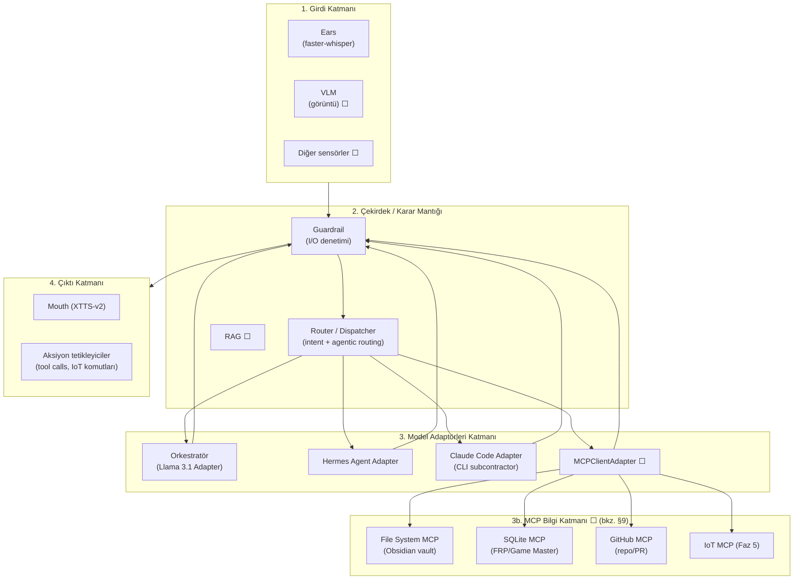
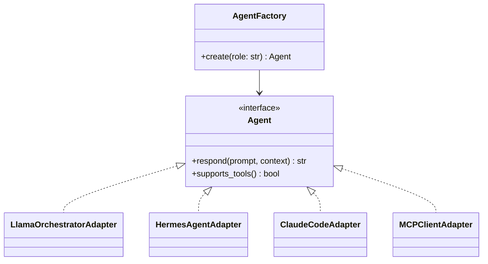
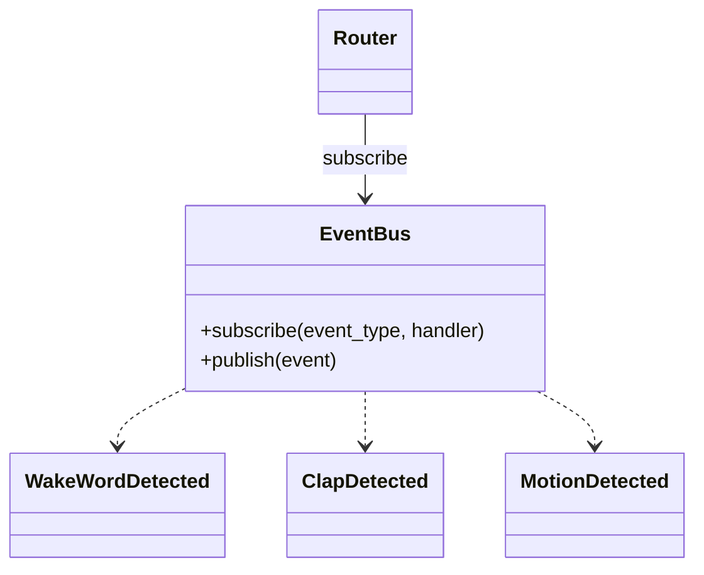
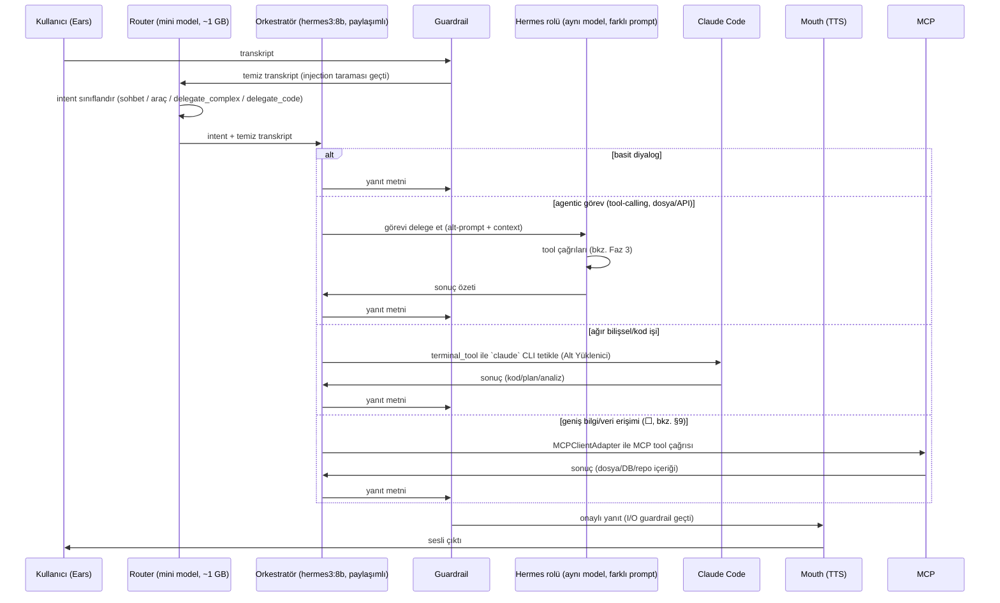
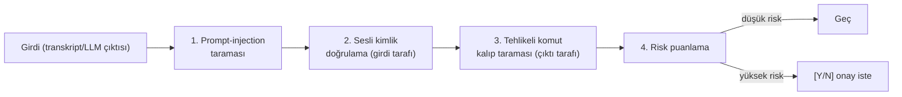
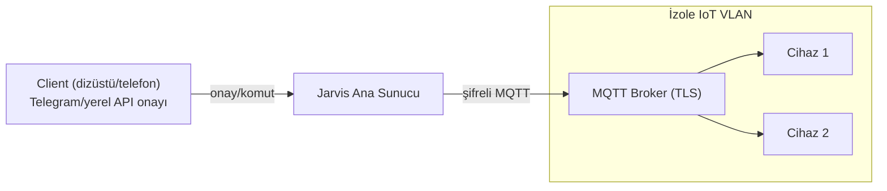

# Jarvis — Mimari Vizyon (Multi-Agent, Guardrail, Zero-Trust)

Bu dosya `docs/ROADMAP.md`'deki Faz 1–6 görev listesinin **arkasındaki
mimari tasarımı** anlatır: katmanlar, design pattern kullanımları,
çoklu-ajan (multi-agent) iletişim şeması, VRAM optimizasyonu ve
güvenlik/guardrail tasarımı. Roadmap "ne zaman/ne" sorusuna, bu dosya
"nasıl/neden" sorusuna cevap verir. `CLAUDE.md`'deki "Mimari (mevcut
durum)" bölümü şu anki (tamamlanmış) koda karşılık gelir; burası hedef
mimaridir — henüz kodda karşılığı olmayan bölümler ⬜ ile işaretlenir.

> **v2 multi-agent güncellemesi (ROADMAP Faz 6):** §4, §5 ve §7 aşağıda
> `docs/jarvis-mimari-v2-multiagent-entegrasyon.md` ile senkronize edildi;
> tümüyle yeni katmanlar §10–13'te. O doküman ayrıntılı spec olarak
> geçerlidir, bu dosyanın yerini almaz.

## 1. Genel İlkeler

- **SOLID + modülerlik**: her yetenek ayrı bir modül/paket; bağımlılıklar
  arayüzler (Protocol/ABC) üzerinden, somut sınıflar üzerinden değil.
- **Human-in-the-loop**: hiçbir yüksek riskli aksiyon (dosya silme, sistem
  ayarı değiştirme, dış API'ye veri gönderme) onaysız çalışmaz (bkz. §6).
- **Zero-Trust**: hiçbir bileşen (ses girdisi, LLM çıktısı, IoT client,
  Claude Code'a giden/gelen veri) varsayılan olarak güvenilir kabul
  edilmez; her sınır geçişinde doğrulama vardır.
- **Yerel-öncelikli**: mümkün olduğunca offline/yerelde çalışır (Ears,
  Brain, Mouth zaten bu ilkeyle kuruldu); Claude Code gibi dış çağrılar
  bilinçli, sınırlı ve loglanan istisnalardır.
- **Hibrit çekirdek/bilgi ayrımı (⬜, bkz. §9)**: işletim sistemi kontrolü
  (terminal, uygulama başlatma, medya) YÜKSEK riskli olduğu için her zaman
  yerel `TOOL_REGISTRY`/`security.yaml` sandbox'ında kalır; MCP yalnızca
  geniş bilgi/veri erişimi (dosya sistemi, veritabanı, GitHub, IoT) için
  kullanılır — "her şeyi MCP'ye bağlama" bilinçli olarak reddedildi.

## 2. Katmanlar



Girdi katmanındaki her olay (wake-word, çift-alkış, ileride VLM/hareket
sensörü) **Observer** deseniyle Çekirdek'e bildirilir (bkz. §3). Çekirdek'ten
çıkan her yanıt/aksiyon, çıktı katmanına ulaşmadan önce yeniden Guardrail'den
geçer (çift yönlü denetim — bkz. §6).

## 3. Design Pattern Kullanımları

### Factory — LLM/ajan bağımsızlığı



`AgentFactory.create("orchestrator" | "tool_agent" | "deep_reasoning")`
çağrısı, hangi model/sağlayıcının arkada çalıştığını çağıran koddan
gizler — `main.py`/`core/router.py` hiçbir zaman `ollama.chat(...)` veya
`anthropic` SDK'sını doğrudan görmez, sadece `Agent.respond(...)` çağırır.
Bu, ileride Llama 3.1 yerine başka bir yerel model denenmek istendiğinde
(veya Hermes rolü için farklı bir checkpoint seçildiğinde) tek değişikliğin
yeni bir Adapter eklemek olmasını sağlar.

### Adapter — sağlayıcı farklarını soğurma

- `LlamaOrchestratorAdapter` → `ollama.chat()` (yerel, `main.py`'deki mevcut
  `think_and_respond()` bu adaptöre taşınacak).
- `HermesAgentAdapter` → yerel tool-calling modeli (bkz. §5 VRAM notu —
  ayrı bir model yerine paylaşımlı model + farklı sistem promptu önerilir).
- `ClaudeCodeAdapter` → **revize edilmiş tasarım (⬜, bkz. §9.3)**: doğrudan
  Anthropic API çağrısı değil, Orkestratör'ün mevcut `terminal_tool`'u
  (`run_command`, zaten HIGH risk + `[Y/N]` onay akışında) üzerinden
  terminalde `claude` CLI komutunu tetikleyip Claude Code'u bir "Alt
  Yüklenici" (subcontractor) olarak çalıştırır — ayrı bir API entegrasyonu/
  credential yönetimi gerekmez, mevcut risk/onay mekanizması yeniden
  kullanılır.
- `MCPClientAdapter` (⬜, bkz. §9) → dış MCP sunucularına (File System,
  SQLite, GitHub, IoT) bağlanıp araçlarını `TOOL_REGISTRY`'ye dinamik olarak
  ekler; sadece bilgi/veri erişimi içindir, işletim sistemi kontrolü asla
  bu yoldan geçmez (bkz. §1 hibrit ilkesi).

Üçü de aynı `Agent` arayüzüne uyduğu için Router (§3'teki Observer'dan gelen
olayı işleyen kod) hangi ajanla konuştuğunu bilmeden çalışır.

### Observer — asenkron sensör olayları



Mevcut `src/jarvis/ears/listener.py:listen_loop()` içindeki IDLE/ACTIVE state machine,
wake-word ve çift-alkış tespitini zaten tek bir `sd.InputStream` üzerinde
yapıyor; bu iyi bir temel. Observer deseni buna, VLM/hareket sensörü gibi
gelecekteki girdi kaynaklarının **aynı Router'a**, `listen_loop()`'u
değiştirmeden bağlanabilmesini sağlayacak ortak bir `EventBus` katmanı
ekler — her yeni sensör kendi `publish()`'ini yapar, Router tek bir yerden
`subscribe` eder.

### Zaten var olan örtük desenler

`src/jarvis/mouth/tts.py` ve `src/jarvis/ears/listener.py`'deki modül-seviyesi model yükleme
(import anında bir kez `WhisperModel`/`Xtts` yükleyip modül değişkeninde
tutma) fiilen bir **Singleton**'dır — yeni modüller (Hermes/Claude adapter)
eklenirken bu deseni bilinçli şekilde sürdür ya da neden sapıldığını
belirt.

## 4. Multi-Agent İletişim Şeması



**Rol dengesi ve token/VRAM israfını önleme ilkeleri:**
- Orkestratör **her zaman** ilk temas noktasıdır ve sürekli VRAM'de kalır
  (`hermes3:8b` — `orchestrator` ve `tool_agent` rolleri **aynı** modeli
  paylaşır, rol farkı yalnızca sistem promptu; iki ayrı 8B model 12 GB'a
  sığmadığı için, bkz. §5).
- Hermes **rolüne** delegasyon yalnızca intent "araç kullanımı gerektiriyor"
  diye sınıflandırıldığında olur; basit sohbet turlarında hiç tetiklenmez.
- Claude Code'a delegasyon **en pahalı ve en nadir** yoldur: yalnızca kod
  tabanına müdahale, derin mimari planlama veya ağır matematiksel
  hesaplama gerektiren görevlerde; router'da `delegate_code_task` sentinel'i
  ile işaretlenir ve `ClaudeCodeAdapter` bunu `terminal_tool`/`run_command`
  (HIGH risk + onay) üzerinden `claude` CLI olarak çalıştırır — ayrı bir
  Anthropic API/credential yolu **yok** (bkz. §3, §9.3). Bu sınırı geçen her
  istek loglanır (Zero-Trust — dış sınır).
- Intent sınıflandırma, orkestratörün 8B çağrısını harcamak yerine ayrı bir
  **mini router modeli** (`qwen2.5:1.5b`/3b, ~1 GB) ile yapılır — kural bazlı,
  few-shot değil. Gerekçe: kural eşleşmeyen her turda router + Brain'in ayrı
  ayrı 8B çağrılmasının gecikmesi (`docs/mimari-genel-bakis.md` §20 madde 1)
  ölçülüp azaltılıyor. Çoklu-ajan yönlendirmesi de aynı router şemasına
  `delegate_complex_task` / `delegate_code_task` sentinel'leri eklenerek
  yapılır (yeni bir sınıflandırma katmanı icat edilmez).

> **Güncelleme (v2 multi-agent entegrasyonu — ROADMAP Faz 6.2–6.3,
> `docs/jarvis-mimari-v2-multiagent-entegrasyon.md` §2):** yukarıdaki şema
> artık tek paylaşımlı `hermes3:8b` + ayrı mini router + router sentinel'leri
> ile canlıya bağlanıyor. `Agent` ABC'ye `respond_stream()` eklenir ve
> `brain/llm.py` sohbet yolu bu arayüzden geçer (§20 madde 2).
>
> **Faz 6.3 aktivasyonu:** router şemasına iki sentetik sentinel — `delegate_
> complex_task` (→ `tool_agent`/`hermes3:8b` ile sınırlı ≤3 adımlı döngü; her
> adım `core/app.py:_execute_tool` üzerinden = onay + guardrail + timeout) ve
> `delegate_code_task` (→ `ClaudeCodeAdapter`). `ClaudeCodeAdapter` yerel
> `claude -p "<task>"` alt sürecini **varsayılan izinlerle** çalıştırır (kod
> tabanını okur, DEĞİŞTİRMEZ; `cwd=PROJECT_ROOT`), anthropic SDK/API key
> KULLANMAZ. `delegate_code` `_prompt_for_approval` (HIGH) kapısından geçer,
> ~120 sn bloklar (kabul edilen sınır — non-blocking varyant Faz 6.7). Tam
> otonom plan→araç→değerlendir döngüsü hâlâ Faz 4 (bkz. v2 §10).

## 5. VRAM Optimizasyon Tavsiyeleri (RTX 4070, 12GB)

Eşzamanlı çalışan modellerin kaba VRAM bütçesi:

| Bileşen | Model | Yaklaşık VRAM |
|---|---|---|
| Ears | faster-whisper `turbo` (float16) | ~1.5–2 GB |
| Ears | openWakeWord (ONNX, IDLE'da) | ihmal edilebilir (CPU'da da çalışır) |
| Orkestratör + Hermes rolü | `hermes3:8b` (Ollama, Q4_K_M — **paylaşımlı**) | ~4.7–5 GB |
| Router | `qwen2.5:3b` (Ollama) | ~2.2 GB (v2 Faz B) |
| Hafıza (opsiyonel, kararsız) | Mem0 CPU embedding (`all-MiniLM-L6-v2`) | ~0 GB GPU (CPU) |
| Mouth | XTTS-v2 (tek instance) | ~2–3 GB |
| **Toplam (4'ü de hot — ÖLÇÜLEN)** | | **~11.5 GB / 12 GB** |

`orchestrator` ve `tool_agent` **ayrı** 8B checkpoint olsaydı toplam bütçe
12 GB sınırını aşardı. Ölçülen ~11.5 GB sınıra yakın ama çalışıyor;
uygulanan/olası kaldıraçlar:

1. **Paylaşımlı model, çoklu persona (✅ uygulanıyor — v2 Faz B, Seçenek A)**:
   Hermes ayrı bir checkpoint değil, aynı `hermes3:8b`'nin farklı bir sistem
   promptuyla çağrılan bir "rolü". Tool-calling için Hermes-3'ün native
   function-calling desteği yeterli; ayrı bir model indirmeden Factory'de
   `create("tool_agent")` aynı Adapter'ı farklı `role_prompt` ile döndürür.
   (Model seçimi Faz B öncesi Hermes3 vs Qwen3 A/B testiyle netleşir; sadece
   `ROLE_MODEL_MAP` string'i değişir.)
2a. **Router `keep_alive="2m"` (✅ uygulandı — Faz 6.3)**: `OllamaAgentAdapter`'a
   `keep_alive` parametresi eklendi; `AgentFactory.create("router")` bunu `"2m"`
   ile döndürüyor. `qwen2.5:3b` aktif konuşmada hot kalır, konuşma bitince ~2 dk
   sonra VRAM'den çıkıp ~2.2 GB serbest bırakır (Ollama varsayılanı 5 dk).
2. **Sıralı yükleme (daha agresif, gerekirse)**: Ollama'nın
   `keep_alive` parametresiyle aktif olmayan modelin VRAM'i serbest
   bırakılır (`keep_alive=0` router'ı her çağrıda soğuk yükletir — ~1-2 sn
   gecikme maliyeti); aynı anda **en fazla 2 LLM** VRAM'de tutulur (Orkestratör + o an aktif
   olan ajan), üçüncüsü asla eşzamanlı yüklenmez.
3. **XTTS bilingual switch VRAM-nötr**: Faz 1'deki tek-motor çift-dilli TTS
   zaten VRAM eklemez — sadece referans embedding (`gpt_cond_latent`,
   `speaker_embedding`) TR/EN için ayrı hesaplanıp saklanır (birkaç MB),
   model instance'ı tek kalır.
4. **Claude Code hiç yerel VRAM harcamaz** (dış API) — bu üçlü denge içinde
   "sınırsız bilişsel kapasite, sıfır yerel VRAM maliyeti" seçeneği olarak
   düşünülmeli, sadece ağ gecikmesi ve maliyet (token) trade-off'u var.

## 6. Güvenlik Mimarisi (Zero-Trust & Guardrail)

### Guardrail katmanı — Chain of Responsibility



Her kontrol bağımsız bir sınıf (`GuardrailCheck` arayüzü), sırayla
çalıştırılır; biri reddederse zincir durur ve neden loglanır. Bu, OWASP LLM
Top 10'daki **Prompt Injection** ve **Insecure Output Handling**
maddelerine doğrudan karşılık gelir.

### Risk puanlama ve onay akışı

| Aksiyon türü | Risk | Davranış |
|---|---|---|
| Dosya okuma, sistem durumu okuma | Düşük | Doğrudan çalışır |
| Dosya yazma/oluşturma | Orta | Terminale özet + `[Y/N]` |
| Dosya silme, sistem ayarı değiştirme, dış API'ye veri gönderme | Yüksek | Zorunlu `[Y/N]` onayı, varsayılan **N** |
| Kök dizin erişimi / donanım müdahalesi | Kritik | `[Y/N]` yetmez → RFID fiziksel onayı gerekir |

### RFID fiziksel sudo (⬜)

Kritik işlemler için yazılım onayı (`[Y/N]`) yeterli görülmez; bir
`TrustElevation` modülü, RFID okuyucudan gelen bir "sudo" olayını (Observer
ile aynı `EventBus`'a bağlı) bekler ve zaman-sınırlı (ör. 60sn) bir
yükseltilmiş yetki penceresi açar. Bu pencere dışında kritik aksiyonlar
Guardrail tarafından reddedilir.

### Sesli kimlik doğrulama (⬜)

Ears pipeline'ına opsiyonel bir doğrulama adımı eklenir: transkripsiyon
öncesi/sonrası, konuşmacının ses embedding'i (ör. `resemblyzer`/`pyannote`
tabanlı bir speaker-verification modeli — XTTS'in zaten kullandığı
embedding mantığına paralel, ama ayrı bir model) önceden kaydedilmiş
sahibinin embedding'iyle karşılaştırılır. Eşleşme eşiğinin altındaki
komutlar (özellikle Orta/Yüksek risk içerenler) reddedilir veya ek onay
ister — bu, mikrofona erişimi olan başka birinin ya da bir ses kaydı
oynatmanın (replay attack) yüksek riskli aksiyon tetiklemesini engeller.

### OWASP LLM Top 10 ↔ katman eşlemesi

| OWASP LLM Top 10 | Karşılayan katman |
|---|---|
| LLM01 Prompt Injection | Guardrail C1 (girdi taraması) + sesli kimlik doğrulama |
| LLM02 Insecure Output Handling | Guardrail C3 (çıktı/komut taraması) |
| LLM06 Sensitive Information Disclosure | `.env`/secrets ayrımı (mevcut ilke, `CLAUDE.md`) |
| LLM08 Excessive Agency | Risk puanlama + `[Y/N]`/RFID onay akışı |
| LLM09 Overreliance | Human-in-the-loop ilkesi (§1) |

## 7. Genişletilmiş Klasör Yapısı

`docs/ROADMAP.md` Faz 2'deki modülerleşme dönüm noktası tamamlandı — gerçek
yapı:

```
src/jarvis/
├── ears/listener.py         # ses yakalama + faster-whisper (✅ taşındı)
├── brain/llm.py              # LLM katmanı, streaming + hafıza (✅ taşındı)
├── mouth/tts.py                # TTS, çift-dilli (✅ taşındı)
├── core/
│   ├── app.py                  # run_jarvis() - MVP döngüsü (✅)
│   ├── dispatcher.py           # intent + agentic routing (✅ iskelet, henüz bağlı değil)
│   ├── guardrail/                # I/O guardrail zinciri (✅ iskelet, henüz bağlı değil)
│   ├── hud_bus.py               # JARVIS HUD icin sync->asyncio pub/sub koprusu (✅, Faz 3.4)
│   ├── telemetry.py             # psutil/nvidia-smi sistem telemetrisi (✅, Faz 3.4)
│   ├── api.py                    # FastAPI + WebSocket bridge (web-ui) (✅, Faz 3.4)
│   ├── web_ui_process.py         # web-ui Vite dev sunucusu alt-sureci (✅, Faz 3.4)
│   ├── memory.py                 # Mem0 sarmalayıcı: remember()/recall(), fail-soft (Faz 6.5) ⬜ kararsız
│   ├── scheduler.py              # cron-tabanlı InputEvent üretici, source="scheduled" (Faz 6.6) ⬜
│   ├── continuous_runner.py      # arka plan izleme thread'i, source="continuous" (Faz 6.6) ⬜
│   ├── registry_loader.py        # agents/registry/*.yaml → dinamik Tool yükleyici (Faz 6.4) ⬜
│   └── trace.py                  # SQLite tabanlı çağrı izleme + /trace (Faz 6.9) ⬜
├── adapters/
│   ├── agent_factory.py        # AgentFactory + Llama/Hermes/ClaudeCode adaptörleri (✅; ROLE_MODEL_MAP + respond_stream Faz 6.2) 🟡
│   └── mcp_client_adapter.py   # MCPClientAdapter — MCP bilgi katmanı istemcisi (Faz 4.5) ⬜
├── agents/
│   ├── base.py                   # Agent (ABC) arayüzü (✅; respond_stream() Faz 6.2) 🟡
│   └── registry/                 # dinamik araç/ajan manifest .yaml dosyaları (Faz 6.4) ⬜
├── tools/           # tool-calling entegrasyonları (Faz 3) ⬜
│   ├── project_tool.py          # CreateProjectTool (Faz 6.7) ⬜
│   ├── iot_tool.py               # HomeAssistantTool — yerel, MCP değil (Faz 6.8) ⬜
│   └── subprocess_utils.py       # spawn_detached() — fire-and-forget Popen (Faz 6.7) ⬜
├── security/         # risk puanlama, RFID TrustElevation, ses biyometrisi (Faz 3) ⬜
└── iot/             # uç nokta client protokolü, MQTT (Faz 5) ⬜ — NOT: IoT *kontrolü*
                     #  v2'de tools/iot_tool.py (yerel HA REST); bu paket Faz 5 MQTT/VLAN vizyonu için

config/
├── security.yaml / security.example.yaml       # yerel tool erişim kontrolü (✅; + enabled_dynamic_agents Faz 6.4) 🟡
├── mcp_servers.yaml / mcp_servers.example.yaml  # MCP sunucu tanımları (Faz 4.5; + Drive/Home Assistant Faz 6.8) ⬜
└── scheduled_tasks.yaml / .example              # cron görev tanımları, fail-loud (Faz 6.6) ⬜

templates/CLAUDE.md.template   # CreateProjectTool'un yeni projeye kopyaladığı scaffold (Faz 6.7) ⬜
web-ui/               # React + TS + Vite + three.js HUD arayüzü (✅, Faz 3.4 - bkz. ROADMAP.md)
```

## 8. IoT & Dağıtım Mimarisi (özet)



Jarvis'in ana süreci (Orkestratör + Guardrail + Router) ev ağının geri
kalanından ayrı tutulur; IoT cihazlarıyla haberleşme yalnızca MQTT broker
üzerinden, TLS ile şifreli yapılır — Jarvis IoT cihazlarına doğrudan erişim
yerine yayın/abone (pub/sub) modeliyle konuşur, bu da Zero-Trust ilkesiyle
(bir cihazın ele geçirilmesi diğerlerini doğrudan etkilemez) tutarlıdır.
Dağıtım aşamasında tüm sistem (Ears/Brain/Mouth/Core + guardrail) bir Docker
container'ında (GPU passthrough ile), kompakt bir sistem tray uygulaması
arkasında paketlenir (bkz. Faz 5).

> **v2 ara adım — Home Assistant (ROADMAP Faz 6.8,
> `docs/jarvis-mimari-v2-multiagent-entegrasyon.md` §8.2):** yukarıdaki
> MQTT/VLAN vizyonuna kadarki dönemde ışık/priz/kilit kontrolü için pratik
> bir köprü. İlke ayrımı: IoT **durum okuma** (hangi lambalar açık, sıcaklık)
> Home Assistant MCP sunucusundan geçebilir (salt bilgi); IoT **kontrolü**
> (aç/kapat/kilitle) MCP'den DEĞİL, yerel `tools/iot_tool.py:HomeAssistantTool`
> (HA REST API, `TOOL_REGISTRY`'ye statik kayıtlı) üzerinden yapılır — fiziksel
> etki, "OS kontrolü asla MCP'den geçmez" kategorisine girer. Risk cihaz
> tipine göre: ışık/priz `MEDIUM`, kilit/güvenlik cihazı `HIGH`. Bu, MQTT
> mimarisinin yerine değil, ona giden yolda onunla birlikte düşünülür.

## 9. Hibrit MCP Mimarisi (Bilgi Katmanı) ⬜

Faz 3'ün tamamlanmasının ardından alınan bilinçli bir mimari karar: MCP
(Model Context Protocol), Jarvis'in **her** dış entegrasyonu için değil,
yalnızca **bilgi/veri erişimi** için kullanılacak. İşletim sistemi
kontrolü (terminal, uygulama başlatma, medya) §1'deki Zero-Trust ilkesi
gereği MCP'nin dinamik/keşif-tabanlı doğasıyla bağdaşmaz — bu yüzden
mevcut yerel `TOOL_REGISTRY`/`security.yaml` sandbox'ında sabit kalır.
Bu bölüm, `docs/ROADMAP.md` Faz 4.5'in arkasındaki "nasıl/neden"i anlatır.

### 9.1 İlke — Neden Hibrit?

- **Yerel çekirdek (değişmez)**: `run_command`, `launch_app`, `media_tool`
  gibi YÜKSEK riskli, geri dönüşü zor aksiyonlar hiçbir zaman bir MCP
  sunucusu üzerinden tetiklenmez — bu araçların risk sınıflandırması,
  onay akışı ve parametre kaynağı (LLM'den mi, sabit regex'ten mi
  geldiği) `core/risk.py`/`core/app.py:_execute_tool()` içinde tek bir
  yerden denetlenebilir olmalı (bkz. §3.3'teki "mimari varsayım" notu,
  `docs/ROADMAP.md`). Bir MCP sunucusu güncellendiğinde/değiştirildiğinde
  bu garantinin kaybolması kabul edilemez.
- **MCP bilgi katmanı (genişleyebilir)**: dosya sistemi, veritabanı,
  GitHub, IoT gibi geniş ve sık değişen bilgi kaynaklarını sıfırdan
  yerel tool olarak yazmak yerine, hazır MCP sunucularına bağlanmak
  mühendislik maliyetini düşürür. Bu araçlar ağırlıkla **okuma** amaçlıdır;
  yazma/aksiyon içeren MCP tool'ları (ör. bir GitHub PR'ı kapatmak) yerel
  `RiskLevel.HIGH` ile aynı `[Y/N]` onay akışından geçirilir (bkz. §9.5).
- **Açık sınır**: bir MCP tool'u asla doğrudan sistem/süreç kontrolü
  (dosya silme, komut çalıştırma, donanım tetikleme) yapamaz — bu tür bir
  ihtiyaç çıkarsa, doğru çözüm o aracı yerel `TOOL_REGISTRY`'ye eklemektir,
  MCP sunucusuna yetki genişletmek değil.

### 9.2 `MCPClientAdapter` Tasarımı

`src/jarvis/adapters/mcp_client_adapter.py` (⬜) — `agents/base.py:Agent`
arayüzüne uyan, ama rolü diğer adaptörlerden farklı bir bileşen: bir LLM'i
sarmalamaz, yapılandırılmış MCP sunucularına bağlanıp `tools/list` ile
araç şemalarını keşfeder ve bunları `adapters/tool_schema.py:
build_ollama_tools()` ile aynı JSON-Schema function-calling sözleşmesine
çevirir — Orkestratör'ün gözünden, bir MCP aracı ile yerel bir `Tool`
arasında fark olmaz.

**Statik `TOOL_REGISTRY` ile gerilim (bilinçli olarak çözülmesi gerekiyor):**
`tools/registry.py:TOOL_REGISTRY` bilinçli olarak statik bir `dict` —
elle, açıkça import edilmiş nesnelerden kurulur, otomatik keşif yoktur
("bir aracın yanlışlıkla kayıtlı olması imkânsız olmalı" ilkesi). MCP
sunucularının araç listesi ise doğası gereği **dinamik**tir (sunucu
tarafında değişebilir, çalışma zamanında keşfedilir). Bu ikisi
birleştirilmeyecek:
- MCP kaynaklı araçlar hiçbir zaman sessizce `TOOL_REGISTRY`'ye
  enjekte edilmez; `MCPClientAdapter` kendi ayrı bir keşif/önbellek
  durumunu tutar ve Router'a yalnızca açıkça "bilgi/veri erişimi" olarak
  sınıflandırılmış turlarda sunulur.
- MCP kaynaklı her araç çağrısına varsayılan olarak en az `RiskLevel.MEDIUM`
  atanır (dış sunucudan gelen veri güvenilmeyen girdi sayılır — Zero-Trust,
  bkz. §9.5) — yerel bir `Tool`'un kendi riskini beyan etmesiyle aynı
  ilke, ama varsayılan taban daha yüksek.

Aynı "statik vs dinamik" gerilimi **yerel** araçlar için de geçerli:
`docs/jarvis-mimari-v2-multiagent-entegrasyon.md` §3, elle import gerektirmeden
araç/ajan eklemek için **allowlist-tabanlı manifest** çözümünü getirir
(`agents/registry/*.yaml` + `config/security.yaml:enabled_dynamic_agents`;
otomatik keşif değil). `tools/registry.py:all_tools()` böylece üç kaynağı
birleştirir — statik `TOOL_REGISTRY` + dinamik manifest + MCP. Tasarım
ayrıntısı: §12 (Agent Registry) ve ROADMAP Faz 6.4.

**Config deseni**: `config/mcp_servers.yaml` (kişisel/makineye özel,
gitignore'da) + `config/mcp_servers.example.yaml` (şablon, commit'lenir).
**Düzeltme (uygulama sırasında bilinçli sapma)**: bu bölüm başta
`security_config.py:load_security_config()`'in fail-loud (dosya yoksa
`FileNotFoundError`) desenini öneriyordu; gerçek uygulamada bunun yerine
**fail-soft** seçildi — MCP, Spotify gibi (bkz. `docs/ROADMAP.md` §3.1)
opsiyonel bir katman olduğu için `core/mcp_config.py:load_mcp_servers_config()`
dosya yoksa/hiçbir sunucu etkin değilse sadece net bir `logger.warning`
basıp boş liste döner — uygulama MCP'siz de çalışmaya devam eder.
`security.yaml` ise HER tool çağrısının bağlı olduğu bir ön-koşul olduğu
için fail-loud kalmaya devam ediyor; ikisi bilinçli olarak farklı.

### 9.3 Kritik Kullanım Senaryoları

- **File System MCP → Obsidian vault**: `security.yaml:obsidian_vault`
  dizininin geniş, arama yapılabilir okunması. Mevcut
  `tools/notes_tool.py`'nin kapsamı bilinçli olarak dar tutulmuştu (tek
  sabit dosya, `Jarvis Notes/Jarvis Log.md` — path traversal riskini
  kapatmak için, bkz. `docs/ROADMAP.md` §3.3); File System MCP bu kapsamı
  GENİŞLETİR ama aynı ilkeyle sınırlı yapılandırılmalı: MCP sunucusu
  sadece `obsidian_vault` kök dizinine, tercihen salt-okunur bağlanır —
  keyfi dosya sistemi erişimi asla verilmez.
- **SQLite MCP → "Asistan Game Master" modu**: FRP (Rol Yapma Oyunları)
  zar mekanikleri, karakter statları ve kural kitapçıkları için yapısal
  sorgu erişimi; Faz 4'teki çok adımlı görev yürütme döngüsüyle
  (plan → araç çağrısı → değerlendir → devam et) doğal olarak örtüşür.
- **GitHub MCP → proje yönetimi**: yazılım ve Godot oyun projeleri için
  repo okuma, PR analizi, commit farklarının izlenmesi — salt-okunur
  öncelikli; bir PR'ı merge etmek/bir issue'yu kapatmak gibi yazma
  işlemleri yerel `RiskLevel.HIGH` ile aynı zorunlu `[Y/N]` onayından
  geçirilmeli (bkz. §9.5, §6 risk tablosu).
- **IoT MCP → Faz 5.1**: ESP32/mikrodenetleyici sistemlerinin bağlanması;
  §8'deki MQTT/VLAN mimarisinin YERİNE değil, onunla BİRLİKTE düşünülmeli
  — cihaz durumu sorgulama (okuma) MCP üzerinden, fiziksel aktüasyon
  komutları yine mevcut MQTT + Zero-Trust risk puanlamasından geçerek.

### 9.4 Ajan Mimarisi ile İlişkisi

§4'teki Orkestratör↔Hermes↔Claude Code iletişimi **MCP standardına
geçmez** — kendi `Agent`/ReAct arayüzünde (`agents/base.py`) kalmaya
devam eder; bu, mevcut senkron `respond()`/`call_tools()` sözleşmesinin
üzerine gereksiz bir protokol katmanı eklemekten kaçınan bilinçli bir
karardır. MCP yalnızca Jarvis'in dış dünyadaki bilgi kaynaklarına açılan
istemci tarafıdır, ajanlar-arası iletişim mekanizması değildir.

`ClaudeCodeAdapter`'ın revize tasarımı da bu ayrıma örnek: §3'teki
açıklamada belirtildiği gibi, doğrudan bir Anthropic API entegrasyonu
yerine Orkestratör'ün zaten var olan `terminal_tool`/`run_command`'ı
(HIGH risk + `[Y/N]` onayı) üzerinden terminalde `claude` CLI'ını bir
alt süreç olarak tetikler — "Alt Yüklenici" (subcontractor) deseni.
Bu, §2.2'deki mevcut `NotImplementedError` stub'ının yerini alacak
revize plandır (uygulanması `docs/ROADMAP.md` Faz 4.5'te).

### 9.5 Güvenlik Notu

MCP sunucuları da tıpkı Claude Code gibi bir **dış sınır**dır (§1
Zero-Trust ilkesi) — hiçbir MCP sunucusu "güvenilir" varsayılmaz. Her MCP
tool çağrısı, yerel bir `Tool` çağrısıyla aynı iki denetimden geçer:
(1) `core/risk.py`'nin risk sınıflandırması + gerekiyorsa `[Y/N]` onayı,
(2) `core/guardrail/` zinciri — çıktı tarafı: bir MCP sunucusundan dönen
HAM içerik, `tools/mcp_tool.py:MCPTool.execute()` içinde, konsola
basılmadan/TTS için kırpılmadan ÖNCE `OutputSafetyCheck`'ten geçer (bkz.
security-reviewer bulgusu — ilk sürümde bu tarama kırpılmış/yer-tutucu
metin üzerinde çalışıyordu, gerçek içerik hiç taranmıyordu; düzeltildi).
Girdi tarafı da genişletildi: bir MCP sunucusunun kendi bildirdiği
`name`/`description`/parametre açıklamaları ("tool poisoning"/rug-pull
saldırı sınıfı — sunucu tarafında değişen bir açıklama router LLM'ini
manipüle edebilir) `adapters/mcp_client_adapter.py:_wrap_mcp_tool()`'da
keşif anında `InputInjectionCheck`'ten geçer; takılan bir araç sessizce
atlanır (asla router'a sunulmaz). Bu, OWASP LLM Top 10 eşlemesindeki (§6)
LLM01/LLM02 maddelerinin MCP entegrasyonuna da aynı şekilde uygulandığı
anlamına gelir.

**Bilinen açık maddeler (security-reviewer incelemesi, kapsam dışı
bırakıldı — ⬜):**
- Filesystem MCP'ye giden `path`/`paths` argümanları için Jarvis
  tarafında (`security_config.py:is_path_safe()` ile) İKİNCİ bir katman
  doğrulama YOK — güvenlik tamamen `@modelcontextprotocol/server-filesystem`
  paketinin kendi sandbox/symlink kontrolüne bırakılmış durumda.
- `npx -y` ile çekilen paket artık sürüm-PİNLİ (`config/mcp_servers.example.yaml`),
  ama bu yine de imza/hash doğrulaması değil — tedarik zinciri riski
  tamamen kapanmadı.
- Faz 4 (Otonom Ajan Döngüsü) MCP sonuçlarını `history`'ye geri
  besleyecek şekilde genişlerse, MCP çıktısının SADECE `OutputSafetyCheck`
  değil `InputInjectionCheck`'ten de geçmesi gerekecek (bugün MCP sonuçları
  hiçbir zaman `history`'ye girmiyor — bu yüzden bugünkü mimaride indirect-
  prompt-injection→LLM ele geçirme senaryosu mitige edilmiş durumda, ama bu
  varsayım Faz 4 ile birlikte yeniden değerlendirilmeli). Aynı gerekçe Faz 6.5
  (kalıcı hafıza) için daha da kritiktir — bkz. §10.

---

> **§10–13 — v2 multi-agent güncellemesi.** Aşağıdaki dört bölüm
> `docs/jarvis-mimari-v2-multiagent-entegrasyon.md` planının (ROADMAP Faz 6)
> getirdiği, mevcut mimaride karşılığı olmayan yeni katmanları özetler.
> Ayrıntılı spec o dokümandadır; buradaki amaç "nasıl/neden"i ve mevcut
> §1–9 ilkeleriyle nasıl tutarlı kaldığını kaydetmektir.

## 10. Kalıcı Hafıza Katmanı — Mem0 (⬜ değerlendiriliyor)

**Karar verilmedi.** Mem0'a bağlanmak, self-hosted bir alternatif seçmek veya
katmanı ertelemek arasında karar netleşmedi — bu bölüm seçilen yön Mem0/benzeri
olursa geçerlidir (bkz. ROADMAP Faz 6.5, v2 §4).

- **Kapsam ayrımı**: `brain/llm.py`'deki `history` (son ~12 mesaj) tek-oturum
  bağlamıdır ve **değişmez**. Mem0, ondan ayrı, **oturumlar-arası kalıcı** bir
  katmandır: geçmiş projeler, kullanıcı tercihleri, aktif proje bağlamı.
- **Arayüz**: `core/memory.py` → `remember(text, metadata) -> None` ve
  `recall(query, k=5) -> list[str]`, ikisi de **fail-soft** (hata → no-op +
  log / boş liste; hafıza servisi çökerse Jarvis çalışmaya devam eder).
- **Guardrail kapısı (en yüksek riskli ekleme, v2 §4.3)**: kalıcı hafızaya
  sızan bir prompt injection tek turluk değildir — her gelecek `recall()`'da
  context'e yeniden girer. Bu yüzden `remember()` yalnızca `OutputSafetyCheck`'ten
  geçmiş (TTS'e giden) metni yazar, ham LLM çıktısını değil; `recall()`
  sonuçları context'e eklenmeden önce `InputInjectionCheck`'ten geçer.
  `core/app.py:_handle_turn()`'de `recall()` çağrısı dispatcher'dan **önce**
  gelir (hafıza, yönlendirmeyi etkileyebilir).
- **Yerel-öncelikli (v2 §4.4)**: self-hosted Mem0 + yerel vektör deposu (Qdrant
  veya SQLite+embedding) + CPU embedding modeli (`all-MiniLM-L6-v2`) — GPU
  bütçesine (§5) dokunmaz.
- **OWASP eşlemesi (§6)**: LLM01'in "kalıcı hafıza" varyantı — girdi taraması
  hem `recall()` çıktısına hem `remember()` girişine uygulanır.

## 11. Execution Modes — Scheduled & Continuous (⬜)

Jarvis'e zamanlanmış (cron) ve sürekli-izleyen (koşul-tetikli) girdi kaynakları
ekler; **hiçbir yeni güvenlik yolu açmaz** (bkz. ROADMAP Faz 6.6, v2 §5).

- **`core/scheduler.py`**: cron-tabanlı; `InputHub`'ın kuyruğuna
  `InputEvent(source="scheduled", text=<önceden tanımlı komut>)` koyar.
  `config/scheduled_tasks.yaml` fail-loud yüklenir (`security.yaml` gibi —
  bozuk/eksik tanım sessizce yutulmaz).
- **`core/continuous_runner.py`**: `jarvis-mic` / `jarvis-text-input` ile aynı
  desende bir daemon thread; bir koşulu izler (dosya değişimi, MCP kaynağı, IoT
  sensörü) ve `InputEvent(source="continuous", ...)` üretir. §19'daki
  (`docs/mimari-genel-bakis.md`) thread haritasına iki yeni satır; `stop_event`
  ile temiz kapanış.
- **Ortak yol**: her iki kaynağın olayları da mevcut `_handle_turn()` →
  guardrail → dispatcher → `_run_tool_pipeline()` zincirinden geçer; tek fark
  `InputEvent.source` alanıdır.
- **Risk kısıtı (v2 §5.3)**: `source in {"scheduled","continuous"}` olan olaylar
  yalnızca `RiskLevel.LOW` aracı **otomatik** tetikleyebilir. Kullanıcı onay
  veremeyecek durumdayken (gece, uzakta) MEDIUM+ bir eylemin otomatik koşması,
  §6'daki "varsayılan RED" ilkesiyle çelişir — bunun yerine bir pending-approval
  kaydı oluşturulur (HUD / `/status`'ta görünür, kullanıcı sonra onaylar/reddeder).
  `execution_mode: scheduled|continuous` işaretli bir manifest MEDIUM+ risk
  beyan ediyorsa `registry_loader` onu boot'ta reddeder.

## 12. Agent Registry — Dinamik Araç/Ajan Ekleme (⬜)

`tools/registry.py:TOOL_REGISTRY`'nin statik `dict` olması bilinçli bir güvenlik
özelliğidir ("bir araç yanlışlıkla kayıtlı olamaz"). Registry, bu ilkeyi
bozmadan genişleme sağlar — **otomatik keşif değil, allowlist tabanlı** (bkz.
ROADMAP Faz 6.4, v2 §3).

- **Manifest**: `agents/registry/*.yaml` — `name`, `description`, `kind`,
  `risk_level`, `execution_mode`, `module`, `class`, `parameters_schema`.
- **Yükleyici**: `core/registry_loader.py:load_dynamic_tools()` yalnızca adı
  `config/security.yaml:enabled_dynamic_agents` listesinde olan manifest'i
  yükler; gerisi sessizce atlanır (fail-closed). Yani bir aracı devreye almak
  **iki elle adım** ister: manifest dosyasını koymak + allowlist'e ad eklemek.
- **Üç kaynak**: `tools/registry.py:all_tools()` = statik `TOOL_REGISTRY` +
  `load_dynamic_tools()` + `MCPClientAdapter` keşfi. Üçü de aynı `Tool`
  sözleşmesine uyar; hiçbiri diğerine sessizce enjekte olmaz (§9.2 ile aynı
  ilke).

## 13. Gözlemlenebilirlik — Tracing (⬜)

`hud_bus`'a benzer ama **kalıcı** bir çağrı-izleme katmanı (bkz. ROADMAP Faz
6.9, v2 §9).

- **`core/trace.py`**: SQLite (`core/trace.db`). Her agent/tool çağrısı için:
  timestamp, rol/model adı, **kırpılmış/hash'lenmiş** girdi özeti (tam metin
  değil — hassas veri birikimini önlemek için), süre (ms), sonuç
  (`success` / `error` / `guardrail_blocked` / `approval_denied`), varsa token
  sayısı.
- **`/trace [n]` CLI komutu**: `core/cli_commands.py` içinde, `/status` ve
  `/debug` ile aynı ailede; son N kaydı gösterir.
- **Amaç**: §5'teki çift-çağrı gecikmesinin (`docs/mimari-genel-bakis.md` §20
  madde 1) gerçek etkisini ölçmek, `delegate_complex_task`'ın kaç adımda
  tamamlandığını görmek, hangi rolün en çok zaman/token harcadığını anlamak.
