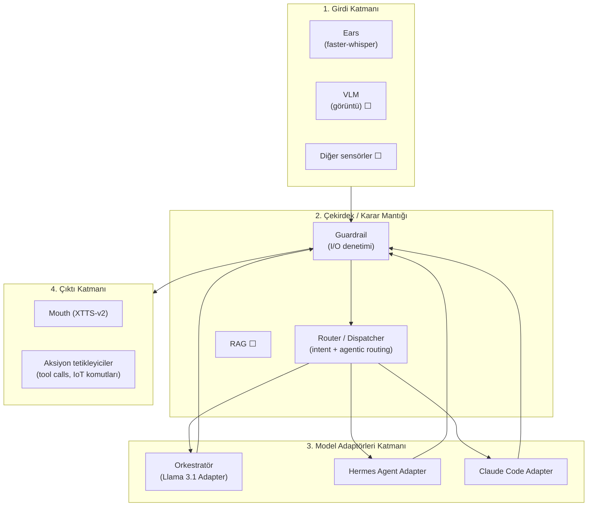
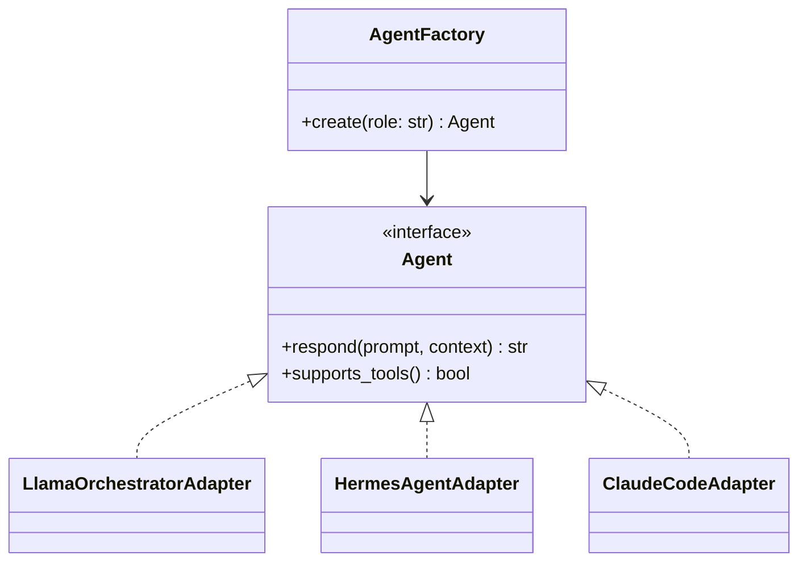
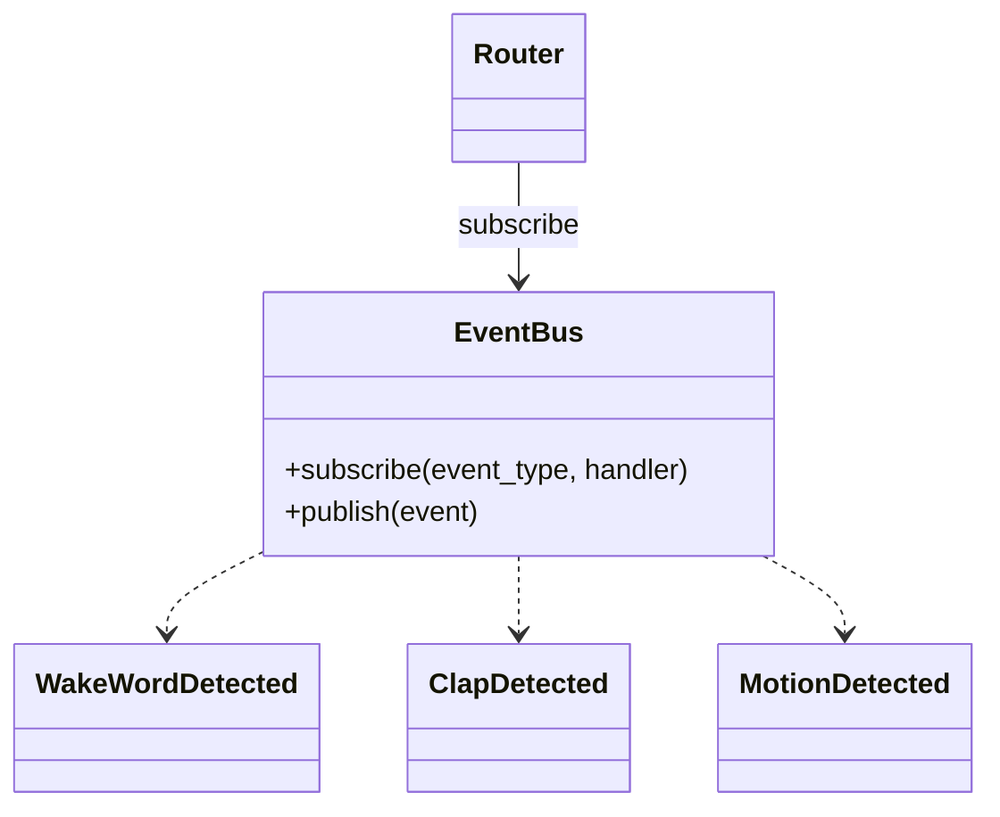
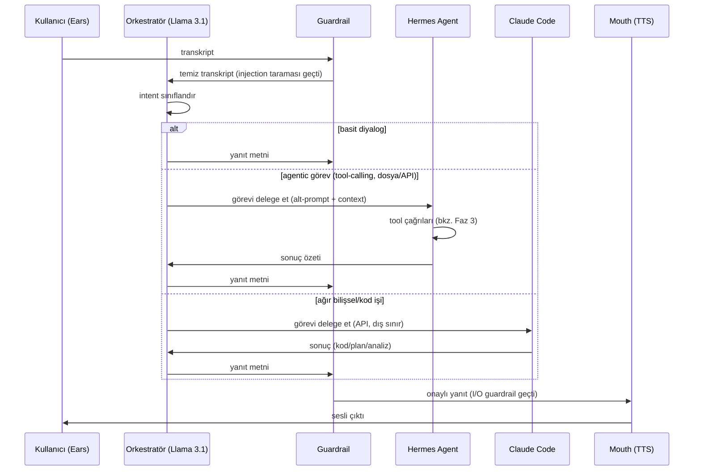
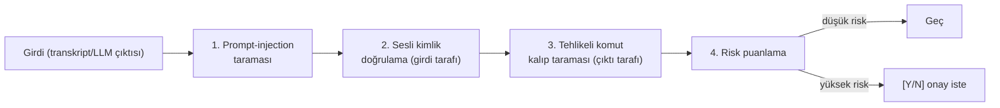
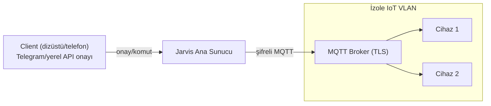

# Jarvis — Mimari Vizyon (Multi-Agent, Guardrail, Zero-Trust)

Bu dosya `docs/ROADMAP.md`'deki Faz 1–5 görev listesinin **arkasındaki
mimari tasarımı** anlatır: katmanlar, design pattern kullanımları,
çoklu-ajan (multi-agent) iletişim şeması, VRAM optimizasyonu ve
güvenlik/guardrail tasarımı. Roadmap "ne zaman/ne" sorusuna, bu dosya
"nasıl/neden" sorusuna cevap verir. `CLAUDE.md`'deki "Mimari (mevcut
durum)" bölümü şu anki (tamamlanmış) koda karşılık gelir; burası hedef
mimaridir — henüz kodda karşılığı olmayan bölümler ⬜ ile işaretlenir.

## 1. Genel İlkeler

- **SOLID + modülerlik**: her yetenek ayrı bir modül/paket; bağımlılıklar
  arayüzler (Protocol/ABC) üzerinden, somut sınıflar üzerinden değil.
- **Human-in-the-loop**: hiçbir yüksek riskli aksiyon (dosya silme, sistem
  ayarı değiştirme, dış API'ye veri gönderme) onaysız çalışmaz (bkz. §6).
- **Zero-Trust**: hiçbir bileşen (ses girdisi, LLM çıktısı, IoT client,
  Claude Code'a giden/gelen veri) varsayılan olarak güvenilir kabul
  edilmez; her sınır geçişinde doğrulama vardır.
- **Yerel-öncelikli**: mümkün olduğunca offline/yerelde çalışır (Ears,
  Brain, Mouth zaten bu ilkeyle kuruldu); Claude Code gibi dış çağrılar
  bilinçli, sınırlı ve loglanan istisnalardır.

## 2. Katmanlar



Girdi katmanındaki her olay (wake-word, çift-alkış, ileride VLM/hareket
sensörü) **Observer** deseniyle Çekirdek'e bildirilir (bkz. §3). Çekirdek'ten
çıkan her yanıt/aksiyon, çıktı katmanına ulaşmadan önce yeniden Guardrail'den
geçer (çift yönlü denetim — bkz. §6).

## 3. Design Pattern Kullanımları

### Factory — LLM/ajan bağımsızlığı



`AgentFactory.create("orchestrator" | "tool_agent" | "deep_reasoning")`
çağrısı, hangi model/sağlayıcının arkada çalıştığını çağıran koddan
gizler — `main.py`/`core/router.py` hiçbir zaman `ollama.chat(...)` veya
`anthropic` SDK'sını doğrudan görmez, sadece `Agent.respond(...)` çağırır.
Bu, ileride Llama 3.1 yerine başka bir yerel model denenmek istendiğinde
(veya Hermes rolü için farklı bir checkpoint seçildiğinde) tek değişikliğin
yeni bir Adapter eklemek olmasını sağlar.

### Adapter — sağlayıcı farklarını soğurma

- `LlamaOrchestratorAdapter` → `ollama.chat()` (yerel, `main.py`'deki mevcut
  `think_and_respond()` bu adaptöre taşınacak).
- `HermesAgentAdapter` → yerel tool-calling modeli (bkz. §5 VRAM notu —
  ayrı bir model yerine paylaşımlı model + farklı sistem promptu önerilir).
- `ClaudeCodeAdapter` → dış API (Anthropic), sadece ağır bilişsel/kod
  görevlerinde, açıkça loglanan ve onaylı bir sınır geçişi olarak.

Üçü de aynı `Agent` arayüzüne uyduğu için Router (§3'teki Observer'dan gelen
olayı işleyen kod) hangi ajanla konuştuğunu bilmeden çalışır.

### Observer — asenkron sensör olayları



Mevcut `src/jarvis/ears/listener.py:listen_loop()` içindeki IDLE/ACTIVE state machine,
wake-word ve çift-alkış tespitini zaten tek bir `sd.InputStream` üzerinde
yapıyor; bu iyi bir temel. Observer deseni buna, VLM/hareket sensörü gibi
gelecekteki girdi kaynaklarının **aynı Router'a**, `listen_loop()`'u
değiştirmeden bağlanabilmesini sağlayacak ortak bir `EventBus` katmanı
ekler — her yeni sensör kendi `publish()`'ini yapar, Router tek bir yerden
`subscribe` eder.

### Zaten var olan örtük desenler

`src/jarvis/mouth/tts.py` ve `src/jarvis/ears/listener.py`'deki modül-seviyesi model yükleme
(import anında bir kez `WhisperModel`/`Xtts` yükleyip modül değişkeninde
tutma) fiilen bir **Singleton**'dır — yeni modüller (Hermes/Claude adapter)
eklenirken bu deseni bilinçli şekilde sürdür ya da neden sapıldığını
belirt.

## 4. Multi-Agent İletişim Şeması



**Rol dengesi ve token/VRAM israfını önleme ilkeleri:**
- Orkestratör **her zaman** ilk temas noktasıdır ve sürekli VRAM'de kalır
  (küçük, hızlı, düşük gecikmeli — mevcut `llama3.1:8b`).
- Hermes'e delegasyon yalnızca intent "araç kullanımı gerektiriyor" diye
  sınıflandırıldığında olur; basit sohbet turlarında hiç tetiklenmez.
- Claude Code'a delegasyon **en pahalı ve en nadir** yoldur: yalnızca kod
  tabanına müdahale, derin mimari planlama veya ağır matematiksel
  hesaplama gerektiren görevlerde; bu sınırı geçen her istek loglanır
  (Zero-Trust — dış sınır).
- Orkestratör'ün sistem promptu, hangi görevin hangi ajana gideceğine dair
  az sayıda net kural içerir (few-shot değil, kural bazlı sınıflandırma) —
  bu, sınıflandırma için ayrı bir model/tur harcamaktan kaçınır.

## 5. VRAM Optimizasyon Tavsiyeleri (RTX 4070, 12GB)

Eşzamanlı çalışan modellerin kaba VRAM bütçesi:

| Bileşen | Model | Yaklaşık VRAM |
|---|---|---|
| Ears | faster-whisper `turbo` (float16) | ~1.5–2 GB |
| Ears | openWakeWord (ONNX, IDLE'da) | ihmal edilebilir (CPU'da da çalışır) |
| Orkestratör | `llama3.1:8b` (Ollama, Q4_K_M) | ~4.7–5 GB |
| Mouth | XTTS-v2 (tek instance) | ~2–3 GB |
| **Toplam (mevcut MVP)** | | **~8.5–10 GB** |

Hermes rolü **ayrı bir model olarak eklenirse** (ör. `hermes-3-llama-3.1-8b`)
toplam bütçe 12GB sınırını zorlar, özellikle Whisper+Orkestratör+Mouth zaten
aktifken. Öneriler:

1. **Paylaşımlı model, çoklu persona (önerilen ⬜)**: Hermes ayrı bir
   checkpoint değil, aynı `llama3.1:8b`'nin farklı bir sistem promptuyla
   çağrılan bir "rolü" olsun. Tool-calling için Llama 3.1'in native
   function-calling desteği yeterli; ayrı bir model indirmeden Factory'de
   `create("tool_agent")` aynı Adapter'ı farklı promptla döndürür.
2. **Sıralı yükleme (Hermes gerçekten ayrı bir model olacaksa)**: Ollama'nın
   `keep_alive` parametresiyle aktif olmayan modelin VRAM'i serbest
   bırakılır (`keep_alive=0` orkestratör beklemedeyken Hermes'e geçişte);
   aynı anda **en fazla 2 LLM** VRAM'de tutulur (Orkestratör + o an aktif
   olan ajan), üçüncüsü asla eşzamanlı yüklenmez.
3. **XTTS bilingual switch VRAM-nötr**: Faz 1'deki tek-motor çift-dilli TTS
   zaten VRAM eklemez — sadece referans embedding (`gpt_cond_latent`,
   `speaker_embedding`) TR/EN için ayrı hesaplanıp saklanır (birkaç MB),
   model instance'ı tek kalır.
4. **Claude Code hiç yerel VRAM harcamaz** (dış API) — bu üçlü denge içinde
   "sınırsız bilişsel kapasite, sıfır yerel VRAM maliyeti" seçeneği olarak
   düşünülmeli, sadece ağ gecikmesi ve maliyet (token) trade-off'u var.

## 6. Güvenlik Mimarisi (Zero-Trust & Guardrail)

### Guardrail katmanı — Chain of Responsibility



Her kontrol bağımsız bir sınıf (`GuardrailCheck` arayüzü), sırayla
çalıştırılır; biri reddederse zincir durur ve neden loglanır. Bu, OWASP LLM
Top 10'daki **Prompt Injection** ve **Insecure Output Handling**
maddelerine doğrudan karşılık gelir.

### Risk puanlama ve onay akışı

| Aksiyon türü | Risk | Davranış |
|---|---|---|
| Dosya okuma, sistem durumu okuma | Düşük | Doğrudan çalışır |
| Dosya yazma/oluşturma | Orta | Terminale özet + `[Y/N]` |
| Dosya silme, sistem ayarı değiştirme, dış API'ye veri gönderme | Yüksek | Zorunlu `[Y/N]` onayı, varsayılan **N** |
| Kök dizin erişimi / donanım müdahalesi | Kritik | `[Y/N]` yetmez → RFID fiziksel onayı gerekir |

### RFID fiziksel sudo (⬜)

Kritik işlemler için yazılım onayı (`[Y/N]`) yeterli görülmez; bir
`TrustElevation` modülü, RFID okuyucudan gelen bir "sudo" olayını (Observer
ile aynı `EventBus`'a bağlı) bekler ve zaman-sınırlı (ör. 60sn) bir
yükseltilmiş yetki penceresi açar. Bu pencere dışında kritik aksiyonlar
Guardrail tarafından reddedilir.

### Sesli kimlik doğrulama (⬜)

Ears pipeline'ına opsiyonel bir doğrulama adımı eklenir: transkripsiyon
öncesi/sonrası, konuşmacının ses embedding'i (ör. `resemblyzer`/`pyannote`
tabanlı bir speaker-verification modeli — XTTS'in zaten kullandığı
embedding mantığına paralel, ama ayrı bir model) önceden kaydedilmiş
sahibinin embedding'iyle karşılaştırılır. Eşleşme eşiğinin altındaki
komutlar (özellikle Orta/Yüksek risk içerenler) reddedilir veya ek onay
ister — bu, mikrofona erişimi olan başka birinin ya da bir ses kaydı
oynatmanın (replay attack) yüksek riskli aksiyon tetiklemesini engeller.

### OWASP LLM Top 10 ↔ katman eşlemesi

| OWASP LLM Top 10 | Karşılayan katman |
|---|---|
| LLM01 Prompt Injection | Guardrail C1 (girdi taraması) + sesli kimlik doğrulama |
| LLM02 Insecure Output Handling | Guardrail C3 (çıktı/komut taraması) |
| LLM06 Sensitive Information Disclosure | `.env`/secrets ayrımı (mevcut ilke, `CLAUDE.md`) |
| LLM08 Excessive Agency | Risk puanlama + `[Y/N]`/RFID onay akışı |
| LLM09 Overreliance | Human-in-the-loop ilkesi (§1) |

## 7. Genişletilmiş Klasör Yapısı

`docs/ROADMAP.md` Faz 2'deki modülerleşme dönüm noktası tamamlandı — gerçek
yapı:

```
src/jarvis/
├── ears/listener.py         # ses yakalama + faster-whisper (✅ taşındı)
├── brain/llm.py              # LLM katmanı, streaming + hafıza (✅ taşındı)
├── mouth/tts.py                # TTS, çift-dilli (✅ taşındı)
├── core/
│   ├── app.py                  # run_jarvis() - MVP döngüsü (✅)
│   ├── dispatcher.py           # intent + agentic routing (✅ iskelet, henüz bağlı değil)
│   ├── guardrail/                # I/O guardrail zinciri (✅ iskelet, henüz bağlı değil)
│   └── events.py                # EventBus (Observer) ⬜ henüz yok
├── adapters/agent_factory.py   # AgentFactory + Llama/Hermes/ClaudeCode adaptörleri (✅)
├── agents/base.py                # Agent (ABC) arayüzü (✅)
├── tools/           # tool-calling entegrasyonları (Faz 3) ⬜
├── security/         # risk puanlama, RFID TrustElevation, ses biyometrisi (Faz 3) ⬜
└── iot/             # uç nokta client protokolü, MQTT (Faz 5) ⬜
```

## 8. IoT & Dağıtım Mimarisi (özet)



Jarvis'in ana süreci (Orkestratör + Guardrail + Router) ev ağının geri
kalanından ayrı tutulur; IoT cihazlarıyla haberleşme yalnızca MQTT broker
üzerinden, TLS ile şifreli yapılır — Jarvis IoT cihazlarına doğrudan erişim
yerine yayın/abone (pub/sub) modeliyle konuşur, bu da Zero-Trust ilkesiyle
(bir cihazın ele geçirilmesi diğerlerini doğrudan etkilemez) tutarlıdır.
Dağıtım aşamasında tüm sistem (Ears/Brain/Mouth/Core + guardrail) bir Docker
container'ında (GPU passthrough ile), kompakt bir sistem tray uygulaması
arkasında paketlenir (bkz. Faz 5).
