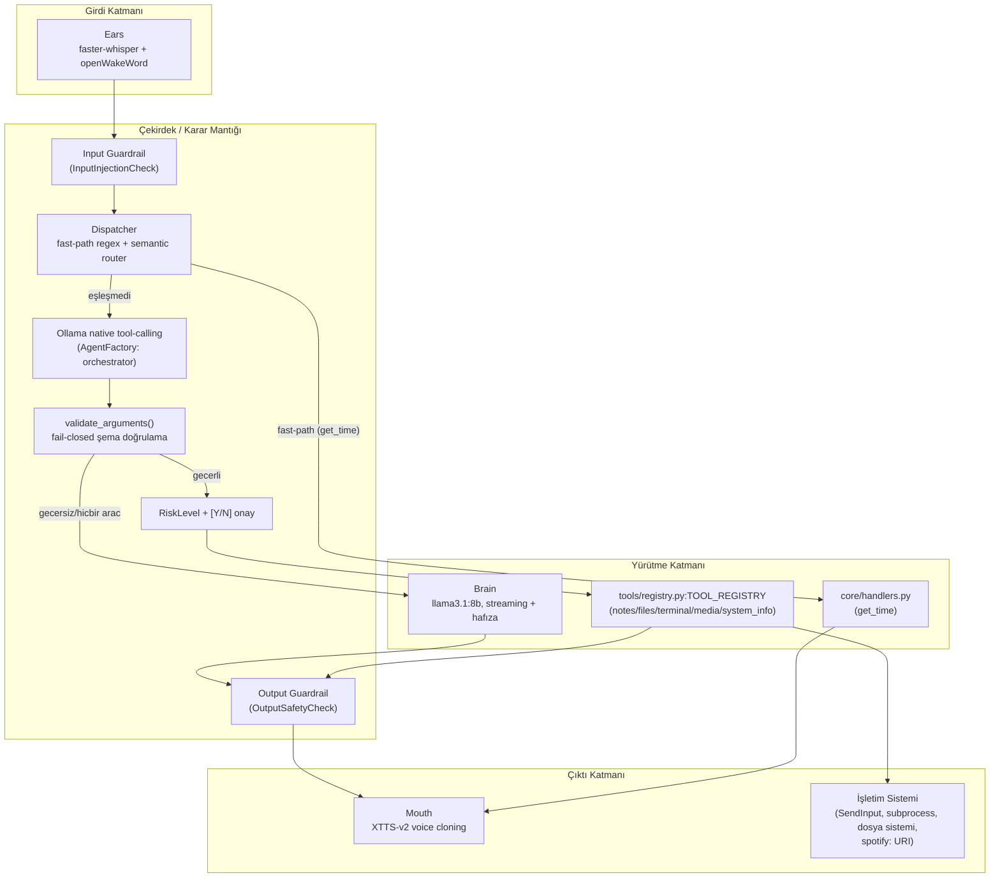
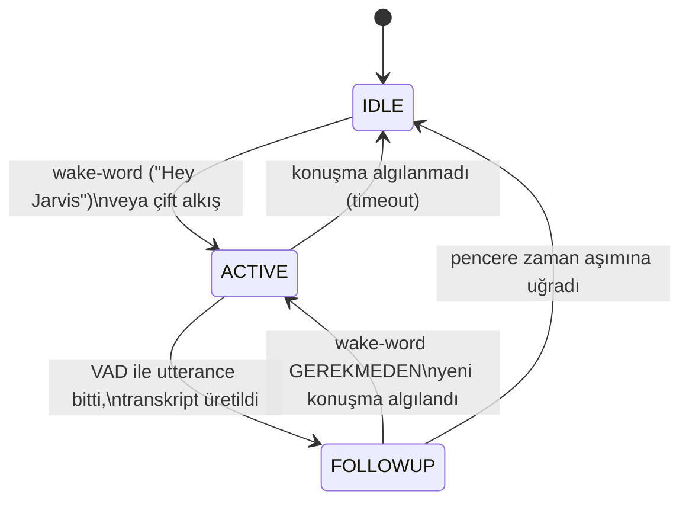
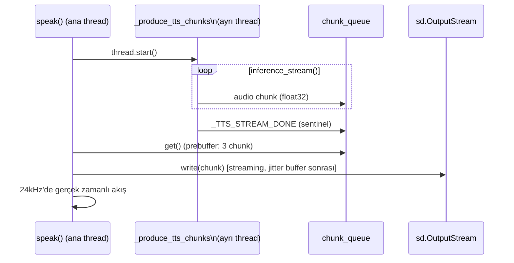
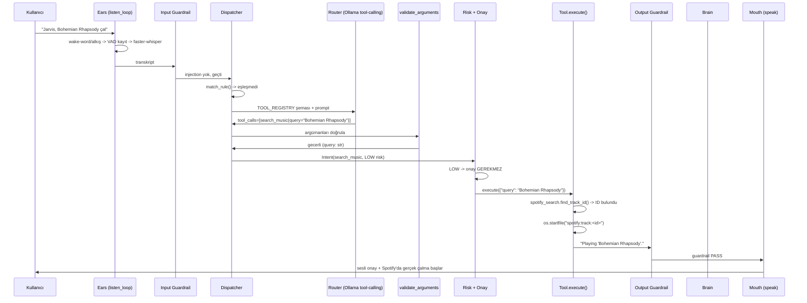
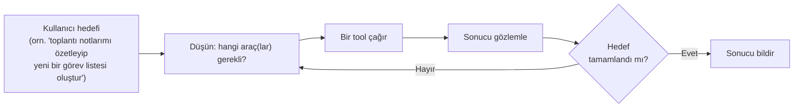

# JARVIS — Sistem Mimarisi ve Onboarding Rehberi

> Bu belge, projeye yeni katılan bir mühendisin kod tabanını sıfırdan
> anlaması için yazıldı. `docs/ARCHITECTURE.md` hedef mimariyi, `docs/
> ROADMAP.md` "ne zaman ne yapıldığını" anlatır — bu belge ikisini
> birleştirip **şu an gerçekte çalışan sistemi** uçtan uca, kod
> referanslarıyla anlatır. Faz 3 (Computer-Use, Semantic Router, Yerel OS
> Entegrasyonu) tamamlandıktan sonra, Faz 4'e (Otonom Ajan Döngüsü)
> geçmeden önceki bir kesit olarak yazıldı.
>
> Diyagramlar Mermaid formatında — Obsidian bunu native render eder.

---

## 1. Sistem Mimarisi ve Temel Felsefe

### 1.1 Vizyon: API botundan Computer-Use ajanına

Jarvis, "bir API'ye istek atıp cevabı okuyan sesli asistan" olarak
başlamadı, ama ilk somut entegrasyonu (müzik kontrolü) tam olarak buydu:
`tools/spotify.py`, Spotify Web API'sine OAuth ile bağlanıp `play`/`pause`/
`skip` uç noktalarını çağırıyordu. Bu model iki yapısal sorun taşıyordu:

1. **Kırılganlık** — her yeni yetenek yeni bir dış servis, yeni bir OAuth
   akışı, yeni bir credential yönetimi demekti.
2. **Katı eşleştirme** — hangi cümlenin hangi işlevi tetikleyeceği, elle
   yazılmış regex kalıplarıyla (`core/dispatcher.py:_RULES`) sabitlenmişti.
   Kalıp dışına çıkan hiçbir doğal dil ifadesi tanınmıyordu.

**Faz 3.3 geçişi** bunu tersine çevirdi: Jarvis artık dış servislere değil,
**işletim sisteminin kendisine** komut veriyor (medya tuşu simülasyonu,
dosya sistemi, terminal, uygulama başlatma) ve hangi aracın
çağrılacağına katı kurallar değil, yerel bir LLM'in **semantic router**
olarak çalıştığı bir karar mekanizması karar veriyor. Tek istisna:
`tools/spotify_search.py`, Spotify'ın **Client Credentials** (uygulama
kimliği, kişisel OAuth/giriş YOK) akışını sadece "şarkı adını ID'ye
çevirmek" için kullanıyor — asıl çalma işlemi yerel `spotify:track:<id>`
URI protokolüyle tetikleniyor, API üzerinden değil.

Bu, projenin "Computer-Use" felsefesinin özü: **Jarvis bir API istemcisi
değil, bilgisayarı kullanan bir ajan.**

### 1.2 Üç güvenlik ilkesi

Bir LLM'e "bilgisayarı kullanma" yetkisi vermek, doğası gereği riskli bir
mimari karar. Bu risk üç birbirini tamamlayan ilkeyle yönetiliyor:

**Zero-Trust** — hiçbir bileşen varsayılan olarak güvenilir kabul
edilmez. Kullanıcının sesi (`InputInjectionCheck`), LLM'in ürettiği metin
(`OutputSafetyCheck`), LLM'in seçtiği tool argümanları
(`adapters/tool_schema.py:validate_arguments`, fail-closed şema
doğrulaması) ve dosya sistemi erişimi (`core/security_config.py:
is_path_safe`) — her sınır geçişinde ayrı ayrı doğrulanır. Hiçbiri
diğerinin doğrulamasına güvenip kendi kontrolünü atlamaz.

**Sandboxing** — Jarvis'in dosya sistemi ve uygulama erişimi, açık bir
allowlist ile sınırlı. `notes_tool.py` sadece `config/security.yaml`'da
tanımlı Obsidian vault'una, sabit bir dosya adına (`Jarvis Notes/Jarvis
Log.md`) yazar — LLM'in ürettiği bir dosya adını asla kabul etmez.
`terminal_tool.py:LaunchAppTool` sadece `known_applications`
sözlüğündeki isimleri çözer; eşleşme yoksa `subprocess` hiç çağrılmaz.
`files.py:ListFilesTool` dışarıdan yol parametresi hiç kabul etmez.

**Human-in-the-Loop** — geri alınamaz veya kalıcı etkisi olan her eylem
(`core/risk.py:RiskLevel.MEDIUM` ve üzeri), çalışmadan önce kullanıcının
açık `[Y/N]` onayından geçer, **varsayılan RED** ile (boş girdi, tanınmayan
cevap, `EOFError` — hepsi "hayır" sayılır). Onay ekranı, LLM'in ürettiği
**tam parametreleri** büyük bir panelde gösterir
(`core/console.py:print_approval_panel`) — kullanıcı neyi onayladığını
her zaman görür, LLM'in kendi söylediğinden farklı bir argüman üretmiş
olsa bile.

### 1.3 Katman diyagramı



---

## 2. Modül, Sınıf ve Fonksiyon Analizi (Sistemin Anatomisi)

### 2.1 Klasör ağacı

```
main.py                          # ince giriş noktası -> core/app.py:run_jarvis()
system_prompt.txt                # Brain'in (sohbet modu) persona/kuralları
config/
├── security.example.yaml        # şablon (commit'lenir)
└── security.yaml                # kişisel/makineye özel (.gitignore'da)
src/jarvis/
├── ears/listener.py              # ses yakalama: state machine + wake-word + VAD
├── brain/llm.py                  # düz sohbet LLM'i: streaming + hafıza
├── mouth/tts.py                  # TTS: XTTS-v2, çift-dilli, streaming oynatma
├── core/
│   ├── app.py                    # run_jarvis() - ana döngü, tüm katmanları bağlar
│   ├── dispatcher.py             # Intent sınıflandırma: fast-path + semantic router
│   ├── handlers.py               # basit intent -> (metin, dil) eşlemesi (get_time)
│   ├── risk.py                   # RiskLevel + [Y/N] onay mantığı
│   ├── security_config.py        # security.yaml okuma, is_path_safe(), allowlist
│   ├── console.py                # rich tabanlı merkezi konsol/panel/loglama
│   ├── language.py               # paylaşılan dil tespiti (langdetect sarmalayıcı)
│   ├── text.py                   # STT sonrası metin temizleme yardımcıları
│   ├── paths.py                  # PROJECT_ROOT (CWD-bağımsız mutlak yol)
│   └── guardrail/
│       ├── base.py               # GuardrailCheck (ABC) + GuardrailChain
│       ├── input_checks.py       # InputInjectionCheck (OWASP LLM01)
│       └── output_checks.py      # OutputSafetyCheck (OWASP LLM02)
├── tools/
│   ├── base.py                   # Tool (ABC): name/description/risk_level/execute()
│   ├── registry.py               # TOOL_REGISTRY: statik, elle kayıtlı araç sözlüğü
│   ├── notes_tool.py              # CreateNoteTool/ReadNotesTool (Obsidian vault)
│   ├── terminal_tool.py           # RunCommandTool (HIGH) + LaunchAppTool (allowlist)
│   ├── media_tool.py              # medya tuşu simülasyonu + SearchMusicTool
│   ├── spotify_search.py          # Client Credentials arama (kişisel OAuth yok)
│   ├── files.py                   # ListFilesTool (sabit workspace, path param yok)
│   └── system_info.py             # SystemInfoTool (CPU/RAM/GPU)
├── adapters/
│   ├── agent_factory.py           # AgentFactory + Llama/Hermes/ClaudeCode adaptörleri
│   └── tool_schema.py             # Tool -> Ollama function-calling şeması + doğrulama
└── agents/base.py                 # Agent (ABC): respond() + call_tools()
tests/                             # pytest, tüm dış bağımlılıklar (Ollama, ağ,
                                    # SendInput, dosya sistemi) monkeypatch'lenir
docs/                              # ARCHITECTURE.md, ROADMAP.md, bu dosya
```

### 2.2 Ears — `src/jarvis/ears/listener.py`

**Sorumluluk:** mikrofon → metin. Tek bir dosyada, tek bir sürekli açık
`sounddevice.InputStream` üzerinde çalışan bir **state machine**.



- **IDLE** (`_wait_for_wakeword`) — hiçbir şey transkribe edilmez.
  openWakeWord modeli (`hey_jarvis`, ONNX) her 80ms'lik chunk'ta çalışır;
  aynı döngüde **çift alkış tespiti** de RMS/crest-factor (peak/RMS)
  tabanlı, adaptif bir gürültü tabanı (EMA) ile paralel değerlendirilir —
  ayrı bir thread gerekmez, çünkü ikisi de aynı ses chunk'ı üzerinde ucuz
  işlemler.
- **ACTIVE** (`_vad_record`) — `webrtcvad` ile dinamik kayıt: konuşma
  başlayınca kaydeder, `SILENCE_HANGOVER_MS` (700ms) sessizlikte durur.
  Wake-word'ü tetikleyen chunk'ın kendisi de pre-roll tamponuna eklenir
  (`trailing` parametresi) — "Hey Jarvis" dedikten hemen sonra duraksız
  konuşulursa ilk hece kaybolmaz.
- **FOLLOWUP** — bir yanıt üretildikten sonra `FOLLOWUP_WINDOW_MS`
  (12sn) boyunca wake-word gerekmeden dinlemeye devam eder. Kritik
  detay: pencere **sadece gerçek bir transkript üretildiğinde** sıfırdan
  yenilenir; boş/anlaşılmaz turlar (webrtcvad'ın ortam gürültüsünde
  yanlış tetiklenmesi) kalan süreyi tüketir — yoksa sürekli gürültü
  IDLE'a dönüşü süresiz erteleyebilirdi.
- **`_transcribe`** — `faster-whisper` (`turbo`=large-v3-turbo),
  `multilingual=True` (her segment için ayrı dil tespiti, TR/EN karışık
  cümlelerde doğru çalışır), `vad_filter=True`. CUDA başarısız olursa
  (`_load_model_with_fallback`) sessiz bir warm-up transkripsiyonuyla
  gerçek bir inference tetikleyip CPU/int8'e düşer — salt
  `WhisperModel()` constructor'ı CUDA hatasını yakalamaz.

`listen_loop(stop_event)` bu üç durumu döngüye alıp transkriptleri
`yield` eder — `core/app.py:run_jarvis()`'in tükettiği jeneratör budur.

### 2.3 Brain — `src/jarvis/brain/llm.py`

**Sorumluluk:** düz sohbet turlarını (dispatcher hiçbir tool/handler
bulamadığında) yanıtlamak. `think_and_respond_stream(user_input, history)`:

- `ollama.chat(model="llama3.1:8b", stream=True)` ile isteği gönderir.
- Akan yanıtı **cümle cümle** ayırıp (`_SENTENCE_END_RE`: noktalama +
  boşluk) `yield` eder — `core/app.py` her cümleyi üretildikçe `speak()`'e
  besler, TTS tüm yanıt bitmeden başlar (algılanan gecikme düşer).
  Kesirli sayıların ("3.5") veya henüz tamamlanmamış bir cümlenin
  ortasındaki noktanın erken bölünmesini `\s+` (nokta SONRASI boşluk
  zorunluluğu) önler.
- `history` (çağıran tarafta, `run_jarvis()`'in döngü ömrü boyunca
  kalıcı bir liste) her turda `user`/`assistant` mesajlarıyla büyür,
  `MAX_HISTORY_MESSAGES` (12) üstüne çıkarsa en eski turlar kırpılır
  (`_trim_history`) — system mesajı (index 0) hep korunur.
- Hata turlarında `history`'ye **hiçbir şey eklenmez** (bozuk bir
  "assistant" mesajı sonraki turlara bağlam olarak sızmasın diye).
- `system_prompt.txt`'teki kural 5, Brain'in **tool işlevlerini kendisinin
  yapmadığını** açıkça bilmesini sağlar — bir istek dispatcher/router
  tarafından tanınmayıp buraya düşerse, Brain "yaptım" diye halüsinasyon
  görmek yerine sadece "anlamadım" der (uydurma teknik gerekçe/mazeret
  ÜRETMEMESİ de ayrıca kural altına alındı — gerçek kullanım testinde
  "hesabım şarkı değiştiremez" gibi icat edilmiş cevaplar gözlemlendi).

### 2.4 Mouth — `src/jarvis/mouth/tts.py`

**Sorumluluk:** metin → sesli çıktı, Coqui **XTTS-v2** ile zero-shot voice
cloning. Modül import edildiği anda (fonksiyon çağrısı beklemeden) model
diskten/ağdan yüklenir ve referans seslerden **iki dilin** (`en`, `tr`)
`(gpt_cond_latent, speaker_embedding)` çiftleri hesaplanır
(`_compute_voice_profiles`) — TR referansı yoksa TR anahtarı da EN
embedding'ine düşer (VRAM-nötr, hemen çalışır durumda kalır).

`speak(text, language, stop_event)` **producer/consumer** deseniyle
çalışır:



- **Neden ayrı thread:** GPU forward pass (bloklayıcı, GPU-ağır) ile
  `sd.OutputStream.write()` (bloklayıcı IO) aynı thread'de çalıştırılırsa,
  bir inference yavaşlaması doğrudan sese sızıp duraklama/tıkırtı
  yaratıyordu. Producer SADECE üretir, oynatma consumer tarafında (ana
  thread) yapılır.
- **`TTS_QUEUE_MAXSIZE`/`TTS_PREBUFFER_CHUNKS`** — kuyruk sınırsız
  büyümez (bellek), oynatma başlamadan önce birkaç chunk biriktirilir
  (jitter buffer) — ilk chunk'lar genelde en yavaş üretilenlerdir (model
  ısınması), bu pay ilk `write()`'larda ani duraklamayı önler.
- **`_PLAYBACK_LOCK`** (modül-seviyesi `threading.Lock`) — iki `speak()`
  çağrısının sesleri asla üst üste binmez; çağıran taraf (`run_jarvis()`)
  zaten sıralı çağırsa da bu garanti kod seviyesinde kesinleşir.
- **`stop_event` ile graceful shutdown** — üç noktada kontrol edilir:
  çağrıldığında zaten set edilmişse hiç başlamadan döner; prebuffer/
  oynatma döngülerinde set edilirse `out.abort()` (PortAudio
  `Pa_AbortStream`) ile ANINDA durur — normal `close()`'un aksine kalan
  tamponun çalınmasını beklemez (gerçek testte bu fark ~3sn'lik bir
  kapatma gecikmesini ortadan kaldırdı).
- `torchaudio.load` monkeypatch'i (`_load_audio_via_soundfile`) — `torch`
  2.9+'ta varsayılan ses yükleme backend'i FFmpeg gerektiren
  `torchcodec`'e taşındı; bu makinede FFmpeg yok, bu yüzden referans
  `.wav` okuma zaten kurulu olan `soundfile`'a yönlendiriliyor.

### 2.5 Core katmanı

#### `core/app.py` — `run_jarvis()`, ana döngü

Tüm katmanları bağlayan tek yer:

```python
for user_text in listen_loop(stop_event):       # Ears
    for sentence, lang in _handle_turn(...):     # Guardrail + Dispatcher + Brain
        speak(sentence, language=lang, ...)      # Mouth
```

`_handle_turn()`:
1. `_INPUT_GUARDRAIL.run(user_text)` — reddedilirse Brain'e hiç gidilmez.
2. `_DISPATCHER.classify(user_text)` — `Intent` döner (asla `None` değil).
3. `intent.name != "chat"` ise: `intent.source == "llm"` durumunda
   `print_router_decision()` ile router kararı gösterilir; sonra
   `HANDLERS` (basit, LLM gerektirmeyen) veya `TOOL_REGISTRY`
   (`_execute_tool` ile risk kontrollü) yoluna girilir.
4. Aksi halde `think_and_respond_stream()` (Brain) — her cümle
   `_OUTPUT_GUARDRAIL`'den geçer, reddedilen cümleler sessizce atlanır.

`_execute_tool(tool, intent, stop_event)` — güvenlik kararının **tek
merkezi**: `intent.parameters`'taki `lang` hariç TÜM değerler (tip ne
olursa olsun `str()` ile) hem `OutputSafetyCheck`'ten geçirilir hem de
onay panelinde gösterilir; `requires_approval(tool.risk_level)` doğruysa
`[Y/N]` istenir; `tool.execute()` bir `try/except` içinde çağrılır (tek
kötü tool çağrısı ana döngüyü çökertmez).

#### `core/dispatcher.py` — Semantic Router

```python
class Dispatcher:
    def match_rule(text) -> Optional[Intent]:   # SADECE get_time, LLM'e hiç gitmez
    def classify(text) -> Intent:                 # her zaman bir Intent döner
```

`classify()`: önce `match_rule()` (fast-path), eşleşmezse
`TOOL_REGISTRY`'deki her aracı `adapters/tool_schema.py:build_ollama_tools()`
ile bir JSON-Schema function tanımına çevirip
`AgentFactory.create("orchestrator").call_tools(text, tools=schema)`
çağırır. Model **structured** `tool_calls` döner (serbest metin parse
edilmez). Seçilen aracın argümanları `validate_arguments()` ile fail-closed
doğrulanır (bkz. §2.7); doğrulama başarısızsa veya hiç araç seçilmediyse
`Intent(name="chat", source="llm")` döner — Brain'e düşer.

**`Intent`** (Pydantic): `name`, `confidence`, `parameters: dict`,
`source: Literal["rule","llm"]`.

#### `core/guardrail/` — Chain of Responsibility

`GuardrailCheck(ABC)` → `check(text) -> GuardrailResult`.
`GuardrailChain(checks: list)` → sırayla çalıştırır, **ilk reddeden**
kontrolde durur. Yeni bir kontrol eklemek (örn. gelecekte ses biyometrisi)
mevcut kontrollere dokunmadan zincire bir eleman eklemekten ibaret
(Open/Closed). İki somut kontrol var: `InputInjectionCheck` (OWASP LLM01,
regex tabanlı prompt-injection kalıpları) ve `OutputSafetyCheck` (OWASP
LLM02, Windows/PowerShell/LOLBAS destekli tehlikeli komut kalıpları — bu
proje boyunca güvenlik incelemeleriyle iki kez genişletildi).

#### `core/risk.py` — Zero-Trust onay akışı

`RiskLevel(Enum)`: LOW (onaysız çalışır) / MEDIUM (kalıcı değişiklik) /
HIGH (yıkıcı olabilir, istisnasız onay) / CRITICAL (henüz kullanılmıyor —
RFID donanımı yok). `requires_approval()` ve `request_approval()`
(bloklayıcı `[Y/N]`, varsayılan RED) — karar HER ZAMAN `core/app.py`'de
merkezi olarak veriliyor, bir Tool kendi riskini asla beyan edemez.

#### `core/security_config.py` — allowlist + path-safety

`config/security.yaml`'dan (`.gitignore`'da; şablonu `security.example.yaml`
commit'lenir) `allowed_directories`, `known_applications`,
`obsidian_vault` okur. `is_path_safe()` — `Path.resolve()` (symlink
kaçışını çözer) + `Path.is_relative_to()` (string-prefix DEĞİL, bu
"C:\vault2" gibi kardeş dizinlerin yanlışlıkla "içeride" sayılmasını
önler).

#### `core/console.py` — rich tabanlı merkezi UI

`print_system`/`print_agent`/`print_guardrail` (diyalog/durum),
`status_spinner` (I/O bekleme), `print_approval_panel`/
`print_router_decision` (rich `Panel`, LLM'in ürettiği TAM parametreleri
gösterir). Kullanıcıdan/LLM'den gelen her metin `rich.markup.escape()`
ile geçirilir — asla doğrudan markup olarak yorumlanmaz. Sadece ASCII
ikonlar (`[OK]`, `[!]`) — Windows konsol kod sayfası geniş Unicode
aralığını kapsamayabiliyor.

### 2.6 Tools katmanı — `Tool(ABC)` uygulamaları

```python
class Tool(ABC):
    name: str
    description: str          # router'a giden, doğal-dil arac secim metni
    risk_level: RiskLevel
    parameters_schema: dict   # JSON-Schema "properties"
    required_parameters: list[str]
    def execute(self, params: dict) -> str: ...   # TTS'e gidecek TEK cumle
```

| Tool | Risk | Ne yapar |
|---|---|---|
| `CreateNoteTool`/`ReadNotesTool` (`notes_tool.py`) | MEDIUM | Obsidian vault'unda sabit `Jarvis Notes/Jarvis Log.md`'ye yazar/okur — dosya adı LLM'den asla gelmez |
| `ListFilesTool` (`files.py`) | LOW | Sabit `jarvis_workspace/`'i listeler, path parametresi yok |
| `RunCommandTool` (`terminal_tool.py`) | HIGH | Kullanıcının kelimesi kelimesine dikte ettiği komutu çalıştırır (`shell=True`, 15sn timeout + `taskkill /F /T` ile tüm süreç ağacı öldürülür) |
| `LaunchAppTool` (`terminal_tool.py`) | MEDIUM | SADECE `known_applications` allowlist'indeki isimleri çözer |
| `SystemInfoTool` (`system_info.py`) | LOW | CPU/RAM (psutil) + GPU/VRAM (`nvidia-smi` sarmalayıcı) |
| `MediaPlayPauseTool`/`NextTrack`/`PreviousTrack`/`VolumeUp`/`VolumeDown` (`media_tool.py`) | LOW | `ctypes.SendInput` ile Windows sanal medya tuşları |
| `SearchMusicTool` (`media_tool.py`) | LOW | Spotify'da arar; `spotify_search.py` ID bulursa `spotify:track:<id>` ile GERÇEK otomatik çalma, bulamazsa `spotify:search:` ile sadece arama |

`registry.py:TOOL_REGISTRY` — statik, elle kayıtlı `dict[str, Tool]`.
Dinamik keşif **bilinçli olarak yok**: hangi aracın sisteme kayıtlı
olduğu tek bakışta, dosya okunarak görülebilmeli (bir tool "yanlışlıkla"
kayıtlı olamaz).

### 2.7 Adapters katmanı

`agent_factory.py` — `AgentFactory.create(role)` Factory deseni; şu an
sadece `"orchestrator"` (`LlamaOrchestratorAdapter`, `llama3.1:8b`) canlı
döngüde kullanılıyor. `HermesAgentAdapter`/`ClaudeCodeAdapter` `Agent`
arayüzünü karşılıyor ama henüz bağlı değil (Faz 4 adayı).

`tool_schema.py` — `Tool` ↔ Ollama function-calling formatı arası
dönüşüm. `validate_arguments(tool, arguments)`: router'ın ürettiği her
argümanı `tool.parameters_schema`'ya karşı **fail-closed** doğrular —
şemada tanımsız anahtarlar sessizce elenir, tip uyuşmazlığında TÜM çağrı
reddedilir. Bu, küçük yerel modellerin JSON-Schema'ya her zaman
uymayabileceği (bir string yerine liste/sayı üretebileceği) gerçek bir
güvenlik incelemesi bulgusuna yanıttır.

### 2.8 Agents katmanı

`Agent(ABC)`: `respond(prompt, context) -> str` (düz diyalog) +
`call_tools(prompt, tools, context) -> AgentToolResponse` (structured
tool-call). `ToolCall`/`AgentToolResponse` — sağlayıcı-agnostik değer
nesneleri (dataclass).

### 2.9 Tasarım desenleri özet tablosu

| Desen | Nerede | Amaç |
|---|---|---|
| **Factory** | `AgentFactory.create(role)` | Çağıran kod hangi model/sağlayıcının arkada çalıştığını bilmez |
| **Adapter** | `LlamaOrchestratorAdapter` vb. | `ollama.chat()`'i ortak `Agent` arayüzüne sarar |
| **Chain of Responsibility** | `GuardrailChain` | Bağımsız kontroller, ilk red'de durur, Open/Closed |
| **Strategy (örtük)** | `Tool(ABC)` + `TOOL_REGISTRY` | `core/app.py` somut tool sınıfını hiç görmez |
| **Singleton (örtük)** | `ears`/`mouth` modül-seviyesi model yükleme | Import anında bir kez yüklenir, modül değişkeninde tutulur |
| **Producer/Consumer** | `mouth/tts.py:_produce_tts_chunks` + `speak()` | GPU inference ile ses IO'yu ayrı thread'lere böler |

---

## 3. Veri Akışı ve Yürütme

### 3.1 Uçtan uca sequence diyagramı



**HIGH-risk bir dal (`run_command`) için fark:** `Risk` adımında
`[Y/N]` onayı zorunlu — `print_approval_panel()` ile tam komut ekranda
gösterilir, kullanıcı reddederse `T` hiç çağrılmaz.

### 3.2 Threading / Lock / Event yönetimi

Jarvis, karmaşık bir async framework yerine **az sayıda, amaca özel**
threading ilkeli kullanıyor:

- **`stop_event: threading.Event`** — `run_jarvis()` içinde oluşturulur,
  `listen_loop()` ve `speak()`'e geçirilir. `Ctrl+C` yakalanınca set
  edilir; her iki fonksiyon da kendi iç döngülerinde bunu periyodik
  kontrol edip erken çıkar. **Sınırlama:** hâlihazırda çalışan TEK bir
  bloklayıcı model çağrısını (bir Whisper transkripsiyonu, bir Ollama
  isteği) yarıda kesemez — sadece çağrılar ARASINDAKI bekleme
  sürelerini kısaltır.
- **`_PLAYBACK_LOCK: threading.Lock`** (`mouth/tts.py`) — `speak()`
  çağrılarının seslerinin üst üste binmesini kod seviyesinde kesin
  olarak engeller.
- **Producer thread** (`mouth/tts.py:_produce_tts_chunks`, `daemon=True`)
  — GPU inference'i ana thread'den ayırır; `queue.Queue` ile senkronize
  edilir (`TTS_QUEUE_MAXSIZE` ile sınırlı, backpressure sağlar).
- **`wakeword_model`/faster-whisper/XTTS modelleri** — modül-seviyesinde,
  tek instance, tüm çağrılar arasında paylaşılır (thread-safety'leri
  kütüphanelerin kendi sorumluluğunda; Jarvis'in kendi kod yolu tek
  thread'den sıralı çağırır, `_PLAYBACK_LOCK` hariç ek senkronizasyon
  gerektirmez çünkü `run_jarvis()`'in ana döngüsü zaten seri).

### 3.3 Semantic Router akışı — neden bu tasarım

`Dispatcher.classify()`'in iki aşamalı olmasının nedeni performans/
güvenilirlik dengesi: `_RULES`'ta sadece `get_time` kalması, en sık ve en
belirsizlik taşımayan komutun **sıfır LLM gecikmesiyle** yanıtlanmasını
sağlar. Geri kalan her şey router'a gider — **bilinen maliyet**: rule
eşleşmeyen her turda artık (router + varsa Brain) iki ayrı LLM çağrısı
olabiliyor. Bu, Faz 3.3'te bilinçli kabul edilmiş bir trade-off
(`dispatcher.py` docstring'inde "gelecek iyileştirme adayı: router+chat'i
tek streaming çağrısına birleştirmek" olarak not düşüldü).

Router'ın **tool açıklamaları üzerinden yönlendirildiği** gerçek bir
kullanım testinde keşfedildi: küçük yerel model (`llama3.1:8b`), belirsiz/
genel açıklamalı araçlar için (örn. eski `run_command` açıklaması) kendi
"dünya bilgisine" güvenip halüsinasyon üretebiliyordu (var olmayan bir
YouTube video ID'si, olmayan bir kurulum yolu). Çözüm kod değil **prompt
mühendisliği**: her tool'un `description`'ına somut TR/EN tetikleyici
ifadeler + "bunun için X'i kullanma, Y'yi kullan" çapraz-referanslar
eklendi, `_ROUTER_SYSTEM_PROMPT`'a "asla dosya yolu/URL uydurma" kuralı
eklendi. Bu, LLM tabanlı yönlendirmenin klasik regex'ten farkı: doğruluğu
kod değil, **açıklama kalitesi** belirliyor.

### 3.4 Guardrail'in çift yönlü kontrolü

Guardrail zinciri **iki farklı noktada** çalışır, aynı sınıflarla değil
ama aynı desenle:

1. **Girdi tarafı** (`_INPUT_GUARDRAIL`, sadece `InputInjectionCheck`) —
   her transkriptte, Brain/Dispatcher'a gitmeden önce.
2. **Çıktı tarafı** (`_OUTPUT_GUARDRAIL`, sadece `OutputSafetyCheck`) —
   Brain'in ürettiği HER cümlede (streaming, tek tek) VE
   `_execute_tool`'da bir tool'a giden HER parametre değerinde.

Bu ikinci kullanım (tool parametreleri) Faz 3.3'te eklendi: router artık
LLM çıktısı olduğu için, `run_command`'ın `command`'ı da "LLM çıktısı"
sayılıp aynı taramadan geçiyor — eskiden sadece regex'ten gelen `content`
alanı taranıyordu.

---

## 4. Kullanılan Teknolojiler ve Karar Gerekçeleri

| Teknoloji | Katman | Neden seçildi |
|---|---|---|
| **faster-whisper** (`turbo`/large-v3-turbo) | Ears | CTranslate2 tabanlı, orijinal Whisper'a göre çok daha hızlı; `multilingual=True` ile TR/EN karışık konuşmada segment-bazlı dil tespiti |
| **openWakeWord** | Ears | Hafif, ONNX tabanlı, özelleştirilebilir wake-word modeli — sürekli IDLE dinlemede düşük CPU/GPU maliyeti |
| **webrtcvad** | Ears | Endüstri standardı, hafif VAD — utterance sınırlarını (konuşma başlangıcı/bitişi) belirler |
| **Ollama + llama3.1:8b** | Brain, Router | Yerel çalışan, native tool-calling destekleyen bir model — dış API'ye bağımlılık yok, `stream=True` ile düşük algılanan gecikme |
| **Coqui XTTS-v2** | Mouth | Zero-shot voice cloning (birkaç saniyelik referans sesle), çok-dilli fonetik kontrol, streaming inference desteği |
| **rich** | Console/DX | Merkezi, tutarlı terminal UI (renkli loglar, paneller, spinner'lar) — `RichHandler` ile stdlib `logging`'e tek noktadan bağlanır |
| **Pydantic** | `Intent`, config doğrulama | Tip-güvenli veri modelleri, `Field(ge=0.0, le=1.0)` gibi kısıtlarla çalışma-zamanı doğrulama |
| **PyYAML** | `security_config.py` | `config/security.yaml`'ı okumak için — proje genelinde ilk gerçek kullanımı |
| **requests** (+ `python-dotenv`) | `spotify_search.py` | Client Credentials akışı için minimal HTTP istemcisi — `spotipy` gibi ağır bir SDK yerine, sadece iki uç noktaya (token + search) ihtiyaç var |
| **ctypes (stdlib)** | `media_tool.py` | Windows `SendInput` API'sine doğrudan erişim — `keyboard`/`pyautogui` gibi ek pip bağımlılığı eklemeden medya tuşu simülasyonu |
| **threading + queue (stdlib)** | Mouth, app.py | Basit, amaca özel eşzamanlılık — `asyncio`'ya geçiş şu an gerekçelendirilmiyor (tek kullanıcı, seri konuşma turları) |
| **psutil** | `system_info.py` | Platform-bağımsız CPU/RAM sorgulama |
| **pytest + monkeypatch** | `tests/` | Dış bağımlılıkların (Ollama, ağ, `SendInput`, dosya sistemi, `os.startfile`) hiçbiri gerçek testte tetiklenmez — hızlı, deterministik test paketi |

---

## 5. Yol Haritası: Mevcut Durum vs. Final Hedef

### 5.1 Şu an neredeyiz?

| Faz | Durum | Ne sağladı |
|---|---|---|
| **Faz 1** — Ears/Brain/Mouth (MVP) | ✅ | Mikrofon → LLM → sesli çıktı uçtan uca çalışıyor, gerçek mikrofonla doğrulandı |
| **Faz 2** — Agentic Orkestrasyon & Guardrail | ✅ | `Intent`/`Agent`/`Tool` soyutlamaları, guardrail zinciri, `Dispatcher` iskeleti yazıldı |
| **Faz 3.1** — Tool Use | ✅ | `TOOL_REGISTRY`, risk puanlama, terminal/dosya/sistem araçları — başlangıçta rule-based regex ile tetikleniyordu |
| **Faz 3.2** — Zero-Trust Erişim Kontrolü | 🟡 | Risk+onay tamam; sesli kimlik doğrulama (ses biyometrisi) ve RFID fiziksel onay hâlâ bekliyor (donanım gerektiriyor) |
| **Faz 3.3** — Semantic Router & Yerel Computer-Use | ✅ | Bu belgenin konusu: regex → LLM tool-calling geçişi, Spotify API → yerel OS kontrolü + minimal Client Credentials arama |

**Şu an elde edilen somut yetenekler:** doğal dilde (regex kalıbına
bağlı olmadan) tool seçimi; API'siz medya kontrolü + isimle şarkı
arama/otomatik çalma; Obsidian'a not alma; allowlist'li uygulama
başlatma; onaylı terminal komutu çalıştırma; çok katmanlı güvenlik
(guardrail + şema doğrulama + risk onayı + path-safety).

### 5.2 Faz 4 — Otonom Ajan Döngüsü: mevcut mimari üzerine ne inşa edilecek?

Faz 3.3'ün semantic router'ı **tek adımlı**: bir kullanıcı turu, en fazla
bir tool çağrısıyla sonuçlanır. Faz 4'ün vizyonu, bunu **çok adımlı görev
zincirlemeye** (ReAct — Reason+Act — deseni) genişletmek:



Bunun için mevcut mimarinin **hangi parçaları zaten hazır**:

- **`Agent.call_tools()`** zaten çok-turlu bir konuşma geçmişi
  (`context: list[dict]`) kabul ediyor — ReAct döngüsü, her adımın
  sonucunu bir sonraki `call_tools()` çağrısına `context` olarak
  eklemekten ibaret olabilir.
- **`validate_arguments()` + risk/onay akışı** zaten her tool
  çağrısını bağımsız doğruluyor — çok adımlı bir zincirde de her adım
  aynı güvenlik kapılarından geçer, zincirleme özel bir istisna
  gerektirmez.
- **`HermesAgentAdapter`/`ClaudeCodeAdapter`** — `Agent` arayüzünü
  zaten karşılıyor ama henüz canlı döngüye bağlı değil. Faz 4'ün
  "hangi görev hangi ajana" kararı (basit tool seçimi → Orkestratör,
  çok-adımlı agentic görev → Hermes, ağır kod/mimari görevi → Claude
  Code) `docs/ARCHITECTURE.md` §4'te zaten tasarlandı.

**Yeni eklenmesi gereken:** bir döngü kontrolcüsü (kaç adıma kadar
zincirlenebileceğini sınırlayan, sonsuz döngüyü önleyen bir "max
iterations" mekanizması), adımlar arası durum taşıma (bir aracın çıktısı
bir sonrakinin girdisi olabilmeli), ve **kümülatif risk değerlendirmesi**
(tek başına LOW riskli 5 adımın zincirlenmesi, toplamda MEDIUM/HIGH bir
etki yaratabilir — bugünkü tek-adımlı risk modeli bunu hesaba katmıyor,
Faz 4'ün güvenlik tasarımının cevaplaması gereken açık bir soru).

### 5.3 Faz 5 — IoT & Dağıtım (özet)

`docs/ARCHITECTURE.md` §8'de tanımlı: izole bir IoT VLAN'ında MQTT broker
üzerinden (TLS) cihaz kontrolü, Jarvis'in ana sürecinin (Orkestratör +
Guardrail + Router) bu ağdan ayrı tutulması, ve tüm sistemin (GPU
passthrough ile) bir Docker container'ında paketlenmesi. Bu belge
kapsamı dışında — detaylar için `docs/ARCHITECTURE.md`'ye bakın.

---

## Ek: Hızlı Referans — "X'i nerede bulurum?"

| Soru | Cevap |
|---|---|
| Yeni bir tool nasıl eklenir? | `tools/` altına `Tool(ABC)` alt sınıfı yaz, `tools/registry.py:TOOL_REGISTRY`'ye ekle. Router otomatik görür (schema `tool_schema.py` tarafından üretilir). |
| Bir komutun onay istemesi nasıl sağlanır? | `Tool.risk_level = RiskLevel.MEDIUM` (veya üstü) — `core/risk.py:requires_approval()` gerisini otomatik halleder. |
| Yeni bir güvenlik kontrolü nasıl eklenir? | `GuardrailCheck(ABC)` alt sınıfı yaz, ilgili `GuardrailChain([...])` listesine ekle (`core/app.py`). |
| Router'ın yanlış araç seçmesi nasıl düzeltilir? | Genelde kod değil, `Tool.description`'ı somut tetikleyici ifadelerle zenginleştirmek (bkz. §3.3). |
| Test nasıl çalıştırılır? | `python -m pytest tests/ -v` (repo kökünden, bare `pytest` DEĞİL). |
| Kişisel/makineye özel ayarlar nerede? | `config/security.yaml` (gitignore'da) — vault yolu, bilinen uygulamalar. |
